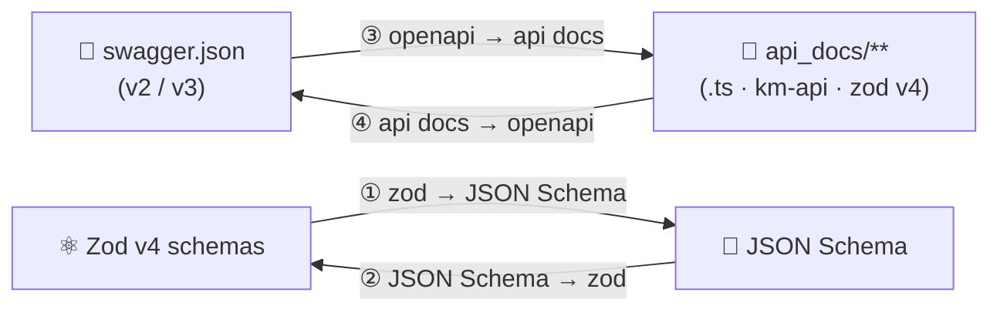

# 🧭 Overview

zopia is a **type-safe OpenAPI ↔ Zod toolkit** for generating, validating, and
transforming API schemas. It converts between the four formats an API team
lives in — **Swagger 2.0**, **OpenAPI 3.x**, **JSON Schema**, and **Zod v4** —
and turns any of them into a tree of **type-safe `km-api` endpoint files** that
drop straight into a TypeScript codebase.

## 🌩️ The problem

API teams keep the same knowledge in many places, and every copy drifts:

| 😖 Pain | 🔍 Consequence |
| --- | --- |
| The spec (`swagger.json`) describes the API | …but the validation code is written by hand |
| Zod schemas validate at runtime | …but they are re-typed from the spec, field by field |
| Components (`$ref`) keep the DRY spec | …but the generated code duplicates the same shapes |
| Swagger 2.0 and OpenAPI 3.x differ subtly | …and both must be supported to read legacy specs |

**Every copy is a source of bugs. Every re-typing is a waste of time.**

## 🛠️ The solution

zopia makes the spec and the code **two views of one fact**:

- **③** reads a spec, resolves every `$ref`, and renders one **`index.ts` per
  endpoint** — each built with `makeApiConfig()` from **km-api** (0.4.x), with
  request/response/params/query/headers/cookies validated by **Zod v4** schemas.
- **④** reads that tree back and regenerates a complete OpenAPI document — so
  developer edits to the generated code become the new spec.
- **① / ②** are the two primitive schema converters the other engines are built on.

## 🎯 The promise

> **Fast and valid developing.** A developer gets **valid, documented,
> type-safe** endpoint code **in seconds**, from a spec they already trust —
> and can always get the spec back.

## 🧰 The stack (fixed, by standard)

| 🧩 Piece | Version | Role in zopia |
| --- | --- | --- |
| ⚛️ [Zod](https://zod.dev/) | **v4** (`^4`) | Runtime validation + static types; built-in `z.toJSONSchema()` |
| 🧱 [km-api](https://www.npmjs.com/package/km-api) | **0.4.x** (`^0.4` from npm) | The "make function" — `makeApiConfig()` builds every generated endpoint |
| 🟣 [Bun](https://bun.sh/) | `≥ 1.1` | Primary runtime & toolchain (runs the package, tests, and generated code) |
| 🧪 [Vitest](https://vitest.dev/) | latest stable | Test runner for the full scenario matrix |
| 🔷 TypeScript | `5.9+`, `strict` | Language of the package and of every generated file |

## 👥 Who is this for?

- 🧑‍💻 **TypeScript backend teams** that maintain a Swagger/OpenAPI spec and
  want the validation layer generated, not hand-written
- 🔄 **Legacy teams** still on Swagger 2.0 who need a path to OpenAPI 3.x
- 🤝 **Full-stack teams** that want one artifact (`api_docs/**`) shared between
  server validation and client code

## 🚫 Non-goals (Phase 1)

Being explicit about what zopia **does not do** keeps the scope honest:

- 🌐 It is **not a runtime** — no HTTP server, no client, no hosting of specs.
  (km-api already provides client adapters; zopia generates the definitions.)
- ✍️ It is **not a spec editor** — it never edits your original spec file.
- 🧮 It does **not execute user code** except through the documented,
  trusted-input contract of engine ④ (see [Standards → Safety](12-standards.md#-safety)).
- 📝 **YAML input** is out of Phase 1 — specs are JSON (`swagger.json` /
  `openapi.json`). YAML arrives in Phase 2 (D-13).

## 💎 Core principles

| # | Principle | Meaning |
| --- | --- | --- |
| P-1 | 🎯 **Deterministic** | Same input + same options ⇒ **byte-identical** output. No timestamps, no random order, no environment leakage. |
| P-2 | 🔒 **Lossless by design** | Every conversion is reversible; what cannot be represented in the target format is recorded (manifest + warnings), never silently dropped. |
| P-3 | 🧼 **Pure core** | All engines are pure functions on in-memory data; file system access lives only at the outer boundary. |
| P-4 | 🛡️ **Safe** | Fail loudly with typed, actionable errors; never write outside the configured output directory; never hide lossy conversions. |
| P-5 | 📖 **Documented** | Every public symbol has JSDoc; every rule is numbered; every decision is recorded. |
| P-6 | 📦 **Dependency-light** | Zero runtime dependencies (Phase 1); `zod` and `km-api` are peer dependencies of the *generated* code. |

## 🔗 Next

- 🎯 What exactly must be built → [Targets](02-targets.md)
- 🗺️ When it ships → [Roadmap](03-roadmap.md)
- 🧩 Words you will keep seeing → [Concepts](05-concepts.md)
