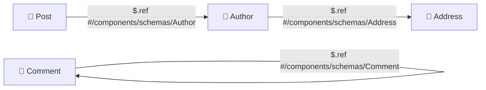

# 🏗️ Architecture

This document defines **how zopia is built**: module layout, the conversion
pipeline, the internal model, the reference graph, and the error/safety model.
It is the contract for implementation — if code and this document disagree,
**this document wins** and the code is fixed (or the document is changed in
the same commit, per the [docs convention](12-standards.md#-docs-convention)).

## 🧩 Module layout

```text
src/
├── index.ts                    # 🚪 Public entry — named exports only (JSDoc'd)
├── types/
│   ├── options.ts              # ⚙️  ZopiaGenerateOptions / ZopiaReverseOptions / …
│   ├── errors.ts               # 🛑 ZopiaError + all error codes
│   └── warnings.ts             # ⚠️  ZopiaWarning shape
├── ir/
│   ├── model.ts                # 🧬 ApiModel, OperationModel, ComponentSchema, ParameterModel
│   └── order.ts                # 📏 canonical-ordering helpers (R-401)
├── engines/
│   ├── zod-to-json-schema/     # ①  zod → JSON Schema
│   │   └── index.ts
│   ├── json-schema-to-zod/     # ②  JSON Schema → Zod (code + runtime)
│   │   ├── index.ts            #    public entry
│   │   ├── emitter.ts          #    recursive keyword emitter
│   │   └── mapper.ts           #    keyword → zod builder table (R-601…)
│   ├── openapi-to-apidocs/     # ③  OpenAPI → api docs
│   │   ├── index.ts            #    public entry (pipeline)
│   │   ├── detect.ts           #    swagger 2.0 / openapi 3.0 / 3.1 detection
│   │   ├── normalize/
│   │   │   ├── v2.ts           #    Swagger 2.0 → ApiModel
│   │   │   └── v3.ts           #    OpenAPI 3.0/3.1 → ApiModel
│   │   ├── refs.ts             #    $ref graph: build, resolve, cycles
│   │   └── render/
│   │       ├── directory.ts    #    layout mode 'directory'
│   │       ├── flat.ts         #    layout mode 'flat'
│   │       ├── endpoint.ts     #    index.ts emitter (makeApiConfig code)
│   │       ├── component.ts    #    components/** emitter
│   │       └── manifest.ts     #    .zopia-manifest.json writer
│   └── apidocs-to-openapi/     # ④  api docs → OpenAPI
│       ├── index.ts            #    public entry (pipeline)
│       ├── loader.ts           #    manifest + module import (trusted, D-08)
│       ├── extract.ts          #    makeApiConfig result → IR
│       └── serializer.ts       #    IR → OpenAPI 3.0/3.1 document
├── ir/
│   └── model.ts                # 🧬 shared IR types re-exports + canonical order
├── fs/
│   └── guard.ts                # 🛡️  outDir guard, path traversal prevention
└── cli/
    ├── index.ts                # ⌨️  entry point (bin: zopia)
    └── args.ts                 #    flag parsing (generate / reverse)
```

> 📏 Naming is fixed: files are `kebab-case.ts`, modules are one concern each,
> and `index.ts` files re-export the module's public surface with JSDoc.
> Unit tests are colocated (`*.test.ts` next to the code); integration and
> round-trip suites live in `tests/`. See [Standards → Naming](12-standards.md#-naming).

## 🔄 The pipeline

Every engine is a **pure pipeline**: in-memory data in, in-memory data out.
File system and process access exist only in the thin outer wrappers
(`openApiToApiDocs` / `apiDocsToOpenApi` and the CLI).

```mermaid
flowchart TB
  subgraph IN ["③ openapi → api docs"]
    A["swagger.json / openapi.json<br/>(JSON object or file path)"] --> B["detect()<br/>2.0 · 3.0 · 3.1"]
    B --> C{"adapter"}
    C -->|swagger 2.0| D["normalize/v2.ts"]
    C -->|openapi 3.x| E["normalize/v3.ts"]
    D --> F["🧬 ApiModel (IR)"]
    E --> F
    F --> G["refs()<br/>$ref graph · cycles → z.lazy plan"]
    G --> H{"mode"}
    H -->|directory| I["render/directory.ts"]
    H -->|flat| J["render/flat.ts"]
    I --> K["endpoint.ts + component.ts + manifest.ts"]
    J --> K
    K --> L["📂 api_docs/**  (.ts files + manifest)"]
  end

  subgraph OUT ["④ api docs → openapi"]
    M["📂 api_docs/**"] --> N["loader()<br/>manifest + import .ts (D-08)"]
    N --> O["extract()<br/>makeApiConfig result → IR"]
    O --> P["🧬 ApiModel (IR)"]
    P --> Q["serializer()<br/>IR → OpenAPI 3.0 / 3.1"]
    Q --> R["📄 openapi.json"]
  end
```



**The internal model (IR) is the fulcrum.** Engines ③ and ④ never talk to each
other directly — both converge on the same `ApiModel`. That is what makes the
round-trip (T-11) a property of the architecture, not of the implementation.

## 🧬 The internal model

Simplified TypeScript sketch (full types live in `src/ir/model.ts`):

```ts
/** 🧬 One normalized API, independent of source spec version. */
export interface ApiModel {
  /** 🏷️  Where the model came from. */
  source: {
    kind: 'openapi-2.0' | 'openapi-3.0' | 'openapi-3.1';
    title: string;
    version: string;
    description?: string;
    sha256?: string; // 🆔 source identity — used by the manifest
  };
  /** 🌍 Server URLs (OpenAPI 3 style). */
  servers: string[];
  /** 🏷️  Ordered tag list (name + optional description). */
  tags: Array<{ name: string; description?: string }>;
  /** 🔐 Security scheme definitions (normalized to OpenAPI 3 style). */
  securitySchemes: Record<string, SecurityScheme>;
  /** 🔐 Default security requirements (when operations don't override). */
  defaultSecurity: SecurityRequirement[];
  /** 🧱 All components.schemas — ordered, refs unresolved (graph is separate). */
  components: ComponentSchema[];
  /** 📡 Every operation, in document order. */
  operations: OperationModel[];
}

/** 📡 One HTTP operation (endpoint). */
export interface OperationModel {
  id: string;            // 🆔 operationId, or derived (see 07 → Naming)
  path: string;          // 🛣️  OpenAPI style: /admin/users/{id}
  method: HttpMethod;    // 🧭  get | post | put | delete | patch | head | options | trace
  summary?: string;      // 📝
  description?: string;  // 📝 (Markdown allowed)
  tags: string[];        // 🏷️
  deprecated: boolean;   // ⛔
  auth: boolean;         // 🔐 any security requirement present?
  security: SecurityRequirement[];
  request: {
    contentType?: string;   // 📦 e.g. 'application/json'
    body?: JsonSchemaObject; // 📦 undefined ⇔ no body (generator emits z.any())
    params:  ParameterModel[]; // 🛣️  in: path
    query:   ParameterModel[]; // ❓  in: query
    headers: ParameterModel[]; // 🎩 in: header
    cookies: ParameterModel[]; // 🍪 in: cookie (v3 only — v2 has none)
  };
  response: {
    statuses: Array<{
      code: string;            // 🚦 '200', '404', …
      description: string;     // 📝 required by the spec
      schema?: JsonSchemaObject; // 📦 undefined ⇔ no content (e.g. 204)
      examples?: Record<string, ExampleObject>;
    }>;
  };
}

/** 🧱 A named, reusable schema (components.schemas / definitions). */
export interface ComponentSchema {
  name: string;          // 🆔 exact spec name — the directory name in api_docs
  schema: JsonSchemaObject;
  title?: string;
  description?: string;
  example?: unknown;     // 📸 kept for reverse fidelity (Phase 1: manifest)
}

/** 🧩 A request parameter in one of the four locations. */
export interface ParameterModel {
  name: string;
  description?: string;
  required: boolean;
  schema: JsonSchemaObject; // 📐 normalized: v2 primitive params get their schema here
  example?: unknown;
}
```

### 🔁 Canonical order (determinism, P-1)

| 📦 Where | 📏 Order |
| --- | --- |
| `ApiModel.operations` | document order of the source spec |
| emitted files (listing) | sorted by `(path, method)` — method order: `get, put, post, delete, options, head, patch, trace` |
| schema properties | document order (JSON object key order of the source) |
| OpenAPI output document | `openapi, info, servers, security, tags, paths, components, externalDocs` |
| path keys inside `paths` | sorted by path string |

> 📌 **Rule R-401** — anywhere zopia *creates* a list or object, the order above
> applies. Anywhere zopia *mirrors* source data (properties, params), the
> source order applies. No `Date.now()`, no `Math.random()` anywhere in the
> package (P-1). Value-level normalizations (Zod sentinel bounds, const-union →
> `enum`, defaulted keys in `required`) live with the engines that apply them —
> see [Conversions → R-618 / R-654](06-conversions.md).

## 🔗 The reference graph

`$ref` is a graph, and it can cycle (e.g. `Comment.replies → Comment`):



**Algorithm** (implemented in `refs.ts`):

1. 🧾 **Collect** — walk the IR; record every `$ref` string and its location.
2. 🗺️ **Build** — graph `G = (components, edges)`.
3. 🛑 **Validate** — unknown ref → `ZOPIA_REF_NOT_FOUND` (with the ref and the
   JSON-pointer location); ref to another file → `ZOPIA_REF_EXTERNAL` (Phase 1
   rejects multi-file refs, D-13/Phase 2); self/cross refs between
   *operations* are allowed (only components form the graph nodes).
4. 🔁 **Find cycles** — strongly-connected components (iterative Tarjan).
5. 🧵 **Plan** — every ref *inside a cycle* is emitted as `z.lazy(() => X)` in
   the generated code; every other ref is a plain reference to a const
   (component mode) or an inlined copy (default mode).

> 📌 **Rule R-402** — circular schemas never fail: they always become
> `z.lazy()`. Linear refs become direct references/imports.

## 🧮 Schema deduplication (within one file)

When a schema shape appears **multiple times** in one endpoint file, the
renderer hoists it into a **file-local const**:

```ts
const error = z.object({ message: z.string() });   // ⤵ used by 401 and 404
response: { 401: error, 404: error }
```

> 📌 **Rule R-403** — hoisting decision is *structural*: a sub-schema with
> **≥ 2 occurrences** in the file becomes a const named after its component
> name (when it is a `$ref`) or after its first property; single occurrences
> stay inlined. This is what keeps generated files readable without imports
> (default mode is self-contained — no cross-file references at all).

## 🛑 Error model

All errors extend one base class — **no raw `Error`, no thrown strings**
(standards → Errors):

```ts
export interface ZopiaError extends Error {
  /** 🆔 Stable machine-readable code, e.g. 'ZOPIA_REF_NOT_FOUND'. */
  code: ZopiaErrorCode;
  /** 📍 JSON-pointer or file location where the problem was found, if any. */
  at?: string;
  /** 💡 Actionable, human-readable suggestion. */
  hint?: string;
}
```

| 🆔 Code | 📍 Where | 💥 When | 💡 Hint pattern |
| --- | --- | --- | --- |
| `ZOPIA_CONFIG_INVALID` | options validation | e.g. `useComponentAsReference: true` without `insertComponents: true` | "enable `insertComponents` first" |
| `ZOPIA_SPEC_INVALID_JSON` | engine ③ entry | input is not valid JSON | "fix the syntax at …" |
| `ZOPIA_SPEC_UNSUPPORTED_VERSION` | `detect()` | neither `swagger: "2.0"` nor `openapi: "3.x"` | "supported: swagger 2.0, openapi 3.0/3.1" |
| `ZOPIA_SPEC_MISSING_PATHS` | normalizers | document has no `paths` | — |
| `ZOPIA_REF_NOT_FOUND` | `refs()` | `$ref` points to nothing | "check #/components/schemas/…" |
| `ZOPIA_REF_EXTERNAL` | `refs()` | `$ref` points to another file (Phase 1) | "multi-file refs land in Phase 2" |
| `ZOPIA_DOCS_MISSING_MANIFEST` | engine ④ | no `.zopia-manifest.json` in docs dir | "generate first, or pass …" |
| `ZOPIA_DOCS_MANIFEST_MISMATCH` | engine ④ | manifest `apis` entry file missing/renamed | "restore the generated file" |
| `ZOPIA_DOCS_IMPORT_FAILED` | engine ④ | imported `index.ts` fails to load or has no `makeApiConfig` export | "the file was hand-broken?" |
| `ZOPIA_FS_OUTSIDE_OUTDIR` | `fs/guard.ts` | a computed write path escapes `outDir` | never happens by construction — defense in depth |

> 📌 **Rule R-404** — every error is thrown as a `ZopiaError` with a stable
> code, a location (`at`) when discoverable, and a `hint`. Tests assert on
> `code`, never on message text.

## 🛡️ Safety & boundaries

| # | Rule | Where enforced |
| --- | --- | --- |
| R-405 | **Pure core** — no `fs`, `process`, or `Date` inside `engines/*`; only the public wrappers and CLI touch the outside world | architecture (module boundaries) + import-lint in tests |
| R-406 | **outDir guard** — every path joined to `outDir` is canonicalized and verified to stay inside it; `..` in spec-derived segment names is impossible because segments are template literals, and flat names are sanitized (see [API docs → Naming](07-api-docs.md#-naming-conventions-fixed)) | `fs/guard.ts` |
| R-407 | **Trusted-input contract** — engine ④ imports generated `.ts` files (executes them). This is by design (D-08) and only for trees that carry a valid zopia manifest | `loader.ts` |
| R-408 | **No silent loss** — every lossy/unsupported conversion produces a `ZopiaWarning` (D-12): `{ code, at, message }` collected on the result, mirrored as `// @zopia:warn …` comments in generated code | every engine |
| R-409 | **Idempotent regeneration** — re-running engine ③ with identical input + options produces byte-identical output; engine ④ output is canonical (R-401) | round-trip tests |

## 📏 Performance

- 🧮 Ref resolution is `O(components + refs)` — no repeated deep walks.
- 🌳 Rendering is streaming-friendly: files are emitted one at a time; a spec
  with thousands of operations stays linear in memory.
- 🚫 No recursion in the ref walker (iterative Tarjan) — deep specs won't
  blow the stack.
- 📦 Generated code size is bounded by deduplication (R-403) and component
  extraction (T-8/T-9).

## 🔗 Next

- 🧩 Vocabulary used above → [Concepts](05-concepts.md)
- 🔄 Engine-by-engine rules → [Conversions](06-conversions.md)
