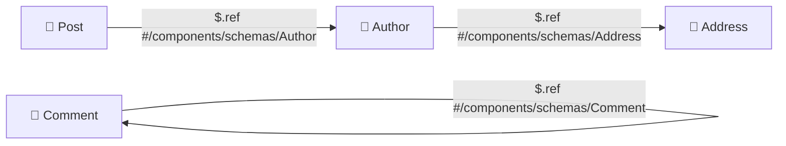

# 🏗️ Architecture

This document describes **how zopia v0.1.0 is built**: module layout, conversion
pipeline, stage-specific representations, reference handling, and the
error/safety model. Code and documentation change together; disagreement is a
release-blocking defect under the
[docs convention](12-standards.md#-docs-convention).

## 🧩 Module layout

```text
.                              # 📦 repository root
├── bin/zopia.js                # ⌨️ npm executable; launches the Bun CLI
├── src/
│   ├── index.ts                # 🚪 public named-export surface
│   ├── cli.ts                  # ⌨️ process entry point
│   ├── cli-command.ts          #    strict parser, help, output/exit contract
│   ├── config.ts               # 🧾 zopia.config.ts discovery, trusted import, validation (D-19)
│   ├── errors.ts               # 🛑 typed error catalogue
│   ├── warnings.ts             # ⚠️ structured warning pipeline
│   ├── validation.ts           # 🧹 zopia validate lint batteries (specs + generated trees, S-89)
│   ├── diff.ts                 # 🔍 zopia diff semantic spec comparison (S-91)
│   └── conversions/
│       ├── zod-to-json-schema.ts       # ① Zod → JSON Schema
│       ├── json-schema-to-zod.ts       # ② JSON Schema → Zod
│       ├── yaml.ts                     #    owned YAML 1.2 core-schema parser (D-16)
│       ├── openapi.ts                  #    dialect/envelope normalization
│       ├── openapi-ref.ts              #    local JSON Pointer resolution
│       ├── openapi-external-ref.ts     #    same-folder external $ref bundling (D-17)
│       ├── openapi-to-api-docs.ts      #    operation collection
│       ├── openapi-ir.ts               #    operation-level generation IR
│       ├── openapi-contracts.ts        #    request/response extraction
│       ├── api-docs-layout.ts          #    directory/flat path mapping
│       ├── api-docs-plan.ts            #    collision-safe file planning
│       ├── api-docs-facade.ts          #    ergonomic access-path helper
│       ├── api-docs-generate.ts        # ③ rendering + guarded writes
│       ├── openapi-to-api-docs-public.ts # public Engine ③ wrapper
│       ├── api-docs-presets.ts         #    split-generation bucket planner (S-92)
│       ├── manifest-writer.ts          #    canonical manifest contract
│       ├── manifest-staleness.ts       #    drift/ownership cleanup
│       ├── manifest-to-openapi.ts      # ④ trusted import + reconstruction
│       └── reverse-security.ts         #    reverse security fallback
├── tests/                       # 🧪 focused, integration, contract, round-trip
├── scripts/                     # 🟣 coverage, golden, package, release gates
└── docs/                        # 📖 this documentation
```

`km-api@^0.4.1` is consumed from npm as a peer and development dependency
(D-15). Generated endpoint files and the golden typecheck use that published
surface directly; there is no vendored copy or package swap remaining.

YAML input (v0.2.x, D-16) is parsed by the owned, deterministic parser in
`src/conversions/yaml.ts` (YAML 1.2 core-schema scalars, block/flow
collections, quoted and block scalars, anchors/aliases/`<<` merge keys,
single-document streams). It stays pure (P-3) and adds no runtime dependency
(D-11); every rejection is a typed `ZOPIA_SPEC_INVALID_YAML`.

File-path inputs additionally resolve **same-folder external `$ref`s** before
normalization (v0.2.x, D-17): `src/conversions/openapi-external-ref.ts` bundles
references like `other.yaml#/pointer` (plus `other.json`/`other.yml`/`./…`
spellings and whole-file targets) inline, with each sibling file read once
(P-1), bundled content deep-cloned, and nested cross-file references resolved
against their owning file. Targets outside the spec folder (URLs, absolute
paths, `../`, subdirectories) still fail with `ZOPIA_REF_EXTERNAL`, exactly
like external references in non-file inputs.

> 📏 Production modules use `kebab-case.ts`; `src/index.ts` is the package-root
> re-export surface. Focused and integration tests live under `tests/`, with
> dedicated `tests/contract/` and `tests/roundtrip/` suites. See
> [Standards → Naming](12-standards.md#-naming).

## 🔄 The pipeline

Conversion work is split between in-memory transforms and explicit adapters.
Engines ①/② are in-memory; the public engine ③/④ wrappers own documented file
reads, guarded generated-tree writes, trusted module imports, and warning
collection. Process arguments/output remain in the CLI.


```mermaid
flowchart TB
  subgraph IN ["③ OpenAPI → api docs"]
    A["object · JSON/YAML text · .json/.yaml path"] --> B["normalizeOpenApiDocument()"]
    B --> C["collectOpenApiOperations()"]
    C --> D["buildOpenApiOperationIR() + extractOperationContracts()"]
    D --> E["planApiDocsFiles()"]
    E --> F["render endpoints/components"]
    F --> G["createZopiaManifest()"]
    G --> H["guarded writes + stale-owned cleanup"]
    H --> I["📂 api_docs/**"]
  end

  subgraph OUT ["④ api docs → OpenAPI"]
    J["📂 api_docs/**"] --> K["validate manifest + owned paths"]
    K --> L["trusted import of endpoint/component .ts"]
    L --> M["runtime Zod → schema serialization"]
    M --> N["apply refs + manifest overlays"]
    N --> O["dialect translation + canonical document"]
  end
```

The manifest boundary in `src/conversions/manifest-writer.ts` separates pure,
detached snapshot construction and canonical validation/serialization from
atomic filesystem output. Engine ③ records source facts that generated Zod or
km-api values cannot carry; engine ④ combines those snapshots with imported
runtime values so developer edits remain authoritative where representable.

Round-trip stability does not depend on one repository-wide `ApiModel`. The
implemented boundaries use a validated document envelope, an operation-level
IR for generation, normalized operation contracts, and the versioned manifest
for reverse reconstruction. Each shape is narrower than the stage that consumes
it, and fixture properties verify their composition (T-11/R-409).

## 🧬 The internal representations

The implementation uses stage-specific public shapes rather than one oversized
model. The generation path starts with the validated source envelope:

```ts
interface NormalizedOpenApiDocument {
  document: OpenApiDocument;
  version: '2.0' | '3.0' | '3.1';
  title?: string;
  versionString?: string;
}
```

Each collected operation is then narrowed to the data endpoint rendering needs:

```ts
interface OpenApiOperationIR {
  path: string;
  method: 'GET' | 'POST' | 'PUT' | 'DELETE' | 'HEAD' | 'OPTIONS' | 'PATCH' | 'TRACE';
  pathShape: string;
  operationId: string;
  summary?: string;
  description?: string;
  tags: string[];
  deprecated: boolean;
  security?: unknown[];
  operation: Record<string, any>;
  parameters: any[];
  document: OpenApiDocument;
}

interface OperationContracts {
  parameters: Array<{
    name: string;
    in: 'path' | 'query' | 'header' | 'cookie';
    required: boolean;
    schema?: unknown;
  }>;
  requestBody?: { contentType: string; schema?: unknown; required: boolean };
  responses: Array<{
    status: string;
    description: string;
    contentType?: string;
    schema?: unknown;
  }>;
}
```

Reverse conversion is anchored by `ZopiaManifest`, not by a hidden in-memory
model. It records source dialect/frame metadata, generated file ownership,
operation snapshots, component schemas, source path order/empty Path Items,
explicit schema-container presence, local-reference placements, and restoration
overlays. Current writer shapes are validated before serialization;
the reader retains explicit compatibility allowances for older optional fields.

### 🔁 Canonical order (determinism, P-1)

| 📦 Where | 📏 Order |
| --- | --- |
| collected operations | source path order; fixed method order `get, post, put, delete, head, options, patch, trace` |
| public generated-file result | lexical order by portable relative `path` |
| runtime schema properties | document order (JSON object key order of the source) |
| generated TypeScript schema maps/literal-object keys | lexical order (reverse restores source `required` order only while membership is unchanged) |
| OpenAPI output document | `openapi, info, servers, security, tags, paths, components, externalDocs` |
| path keys inside `paths` | sorted by path string |

> 📌 **Rule R-401** — anywhere zopia *creates* a list or object, the order above
> applies. Anywhere zopia *mirrors* source data (runtime properties, params),
> the source order applies. Generated TypeScript canonicalizes schema-map and
> literal-object keys so parsing a canonical manifest cannot change the next
> generated tree. No `Date.now()`, no `Math.random()` anywhere in the package
> (P-1). Value-level normalizations (Zod sentinel bounds, const-union →
> `enum`, the `io` input/output split for `required`/`default`) live with the
> engines that apply them — see
> [Conversions → R-615 / R-618 / R-654](06-conversions.md).

## 🔗 The reference graph

`$ref` is a graph, and it can cycle (e.g. `Comment.replies → Comment`):


```mermaid
flowchart LR
  Post["📄 Post"] -->|"$.ref #/components/schemas/Author"| Author["👤 Author"]
  Author -->|"$.ref #/components/schemas/Address"| Address["📍 Address"]
  Comment["💬 Comment"] -->|"$.ref #/components/schemas/Comment"| Comment
```

**Implemented flow** (`openapi-ref.ts`, generation, and manifest modules):

1. 🧷 **Bundle external refs** (file inputs only, D-17) — resolve same-folder
   external references inline first so every later step sees one document.
2. 🛑 **Preflight** — walk source values, reject remaining external refs,
   validate local pointer escapes, and report missing targets with exact
   locations.
3. 🔗 **Resolve operation refs** — path-item and parameter chains use per-chain
   seen sets, so malformed and circular non-schema references fail explicitly.
4. 🧩 **Collect component dependencies** — rendering finds schema-component
   targets while excluding literal/example data that merely contains `$ref` text.
5. 🧵 **Render schemas** — engine ②'s local-definition state and component
   dependency reachability detect recursive edges; self and mutual cycles become
   `z.lazy()` references.
6. 📦 **Record identity** — the manifest stores original reference placements;
   reverse conversion combines those records with imported runtime schema
   identity to restore local `$ref`s.

> 📌 **Rule R-402** — circular schema components remain executable through
> `z.lazy()`, while linear refs become direct references/imports. **Scope:**
> graph nodes are schema components only. Reusable non-schema objects (Swagger
> 2.0 global `parameters`/`responses`, OpenAPI 3
> `components.parameters`/`responses`) *also* get their own component modules in
> components mode (v0.2.x — D-18): a module holds only the declaration's derived
> schema, and in-source declarations plus use-site `$ref` placements restore
> verbatim on reverse conversion while the declaration refreshes from the
> current module. Bare `$ref` use sites import from the per-kind barrels; merged
> `$ref`-sibling forms still resolve at use sites for generated runtime configs.

## 🧮 Schema reuse within generated files

Default mode keeps every endpoint self-contained: each request/parameter/response
schema occurrence is rendered in place. Engine ② may build a local-definition
closure inside an expression when resolving `$defs` or inlined component refs;
it does not hoist structurally identical endpoint contracts into shared top-level
constants.

> 📌 **Rule R-403** — schema reuse is explicit, not inferred from structural
> equality. Default mode independently inlines each contract occurrence. With
> `useComponentAsReference: true`, each referenced component export is imported
> at most once per endpoint and reused wherever that identity occurs.

## 🛑 Error model

All errors crossing a zopia boundary extend one base class — **no raw `Error`, no thrown strings** (standards → Errors). `ZOPIA_ERROR_CODES` is the immutable runtime catalogue and the source of the `ZopiaErrorCode` union; `isZopiaError()` narrows unknown failures and `asZopiaError()` preserves an existing typed error or attaches a lower-level failure as `cause`.

```ts
export class ZopiaError extends Error {
  /** 🆔 Stable machine-readable code, e.g. 'ZOPIA_REF_NOT_FOUND'. */
  readonly code: ZopiaErrorCode;
  /** 📍 JSON-pointer, option name, or file location, when discoverable. */
  readonly at?: string;
  /** 💡 Actionable, human-readable suggestion (always populated). */
  readonly hint: string;
  /** 🔗 Original parser, import, or filesystem failure, when translated. */
  readonly cause?: unknown;
}
```

| 🆔 Code | 📍 Where | 💥 When | 💡 Hint pattern |
| --- | --- | --- | --- |
| `ZOPIA_CONFIG_INVALID` | public options / CLI | an argument, option, or option combination is invalid | "correct the invalid option or argument" |
| `ZOPIA_DOCS_IMPORT_FAILED` | engine ④ | generated modules cannot load, export one expected value, or serialize edited runtime schemas | "fix or regenerate the affected generated module" |
| `ZOPIA_DOCS_MANIFEST_MISMATCH` | engine ④ preflight | a manifest-owned endpoint/component file is missing, renamed, or not a regular file | "regenerate the tree or restore its generated files" |
| `ZOPIA_DOCS_MISSING_MANIFEST` | engine ④ entry | no `.zopia-manifest.json` exists at the selected path | "generate api docs first or pass the manifest path" |
| `ZOPIA_FS_OUTSIDE_OUTDIR` | generation guard | a generated path escapes `outDir` or traverses an unsafe ancestor | "keep generated paths inside the output directory" |
| `ZOPIA_FS_WRITE_FAILED` | writers / CLI | output inspection, directory creation, cleanup, or writing fails | "check the output path, permissions, and available disk space" |
| `ZOPIA_MANIFEST_INVALID` | manifest writer/reader | manifest JSON or metadata violates `zopia:manifest@1` | "regenerate the manifest or fix its invalid metadata" |
| `ZOPIA_REF_EXTERNAL` | external-ref bundling / reference validation | `$ref` escapes the spec folder, or a non-file input points to another file | "keep external targets next to the spec file" |
| `ZOPIA_REF_NOT_FOUND` | reference validation | a local `$ref` is malformed, circular where unsupported, or unresolved | "check that the local JSON Pointer target exists" |
| `ZOPIA_SCHEMA_INVALID` | engines ①/② | the Zod or JSON Schema input cannot be converted | "provide a valid Zod or JSON Schema value" |
| `ZOPIA_SPEC_INVALID` | OpenAPI validation | the parsed document violates the supported Swagger/OpenAPI shape | "fix the invalid Swagger/OpenAPI document" |
| `ZOPIA_SPEC_INVALID_JSON` | JSON entry points | source text is unreadable or not valid JSON | "provide readable, valid JSON" |
| `ZOPIA_SPEC_INVALID_YAML` | YAML entry points | source text is unreadable, malformed/unsupported YAML, or holds a non-JSON value | "provide readable, valid YAML" |
| `ZOPIA_SPEC_MISSING_PATHS` | normalizers | the document has no object-valued `paths` | "add a paths object" |
| `ZOPIA_SPEC_PATH_REF` | operation collection | a path-item reference is invalid or circular | "use a valid local path-item reference" |
| `ZOPIA_SPEC_UNSUPPORTED_VERSION` | normalization | neither Swagger 2.0 nor OpenAPI 3.0/3.1 is selected | "use Swagger 2.0, OpenAPI 3.0, or OpenAPI 3.1" |
| `ZOPIA_WARNING_INVALID` | warnings pipeline | a warning iterable/code/location/message is malformed | "provide a valid warning code, location, and message" |

> 📌 **Rule R-404** — every error is thrown as a `ZopiaError` with a stable
> code, a location (`at`) when discoverable, and a `hint`. Tests assert on
> `code`, never on message text.

## ⚠️ Warning model

Warnings are non-fatal conversion diagnostics. Every public engine uses the
same `ZopiaWarning` contract and stable `ZopiaWarningCode` union:

```ts
interface ZopiaWarning {
  code: ZopiaWarningCode;
  at?: string;       // escaped RFC 6901 JSON Pointer, including leading #
  message: string;
}
```

| 🆔 Stable code | 📝 Meaning |
| --- | --- |
| `ZOPIA_WARN_UNREPRESENTABLE` | a Zod node cannot be represented in the selected schema dialect |
| `ZOPIA_WARN_INVALID_SCHEMA` | a malformed JSON Schema keyword is ignored or approximated |
| `ZOPIA_WARN_CUSTOM_FORMAT`, `ZOPIA_WARN_CONTENT_ENCODING`, `ZOPIA_WARN_INT64` | a string/numeric format or encoding has no exact runtime equivalent |
| `ZOPIA_WARN_LEGACY_EXCLUSIVE_BOUND` | a legacy boolean exclusive bound requires normalization |
| `ZOPIA_WARN_ONE_OF`, `ZOPIA_WARN_NOT`, `ZOPIA_WARN_UNIQUE_ITEMS`, `ZOPIA_WARN_FROZEN_SUBTREE` | an applicator or refinement needs an approximation or frozen manifest restoration |
| `ZOPIA_WARN_REF` | a recoverable schema-reference conversion cannot be exact |
| `ZOPIA_WARN_MULTI_CONTENT`, `ZOPIA_WARN_SERVER_VARIABLES`, `ZOPIA_WARN_WEBHOOKS` | an OpenAPI document fact has no direct generated-code representation |
| `ZOPIA_WARN_STALE_TREE` | regeneration found source/config drift, missing owned files, manifest disablement, or invalid existing metadata |
| `ZOPIA_WARN_DEFAULT_INFO`, `ZOPIA_WARN_DEFAULT_SECURITY` | reverse conversion synthesized documented fallback metadata or security |
| `ZOPIA_WARN_DIALECT_DOWNGRADE` | OpenAPI 3.1-only content is omitted from 3.0 output |

The shared collector validates codes, collapses line breaks in messages,
deduplicates identical diagnostics, and sorts by location, code, then message.
Nested engine warnings are rebased rather than string-concatenated ad hoc, so
`at` always identifies the affected source or output node. Engine ① and engine
④ invoke `onWarning` once per normalized warning; engines ②–④ also return
normalized warning arrays. Engine ② mirrors losses with the canonical marker
`// @zopia:warn CODE subject — message (pointer)`. The CLI renders the same
warning as `Warning: CODE pointer: message` on **stderr**, leaving reverse JSON
on stdout parseable.

## 🛡️ Safety & boundaries

| # | Rule | Where enforced |
| --- | --- | --- |
| R-405 | **Pure core** — schema/operation transforms work on in-memory values; documented file input, generated-tree writes/imports, and process output stay in public adapters and the CLI | conversion modules + `cli-command.ts` |
| R-406 | **outDir guard** — every generated path is canonicalized and verified to stay inside `outDir`; regeneration refuses symlinked path ancestors, and manifest temporary writes use exclusive creation so stale symlinks cannot redirect output. Obsolete cleanup trusts only a fully validated manifest and never recursively deletes an output root | `api-docs-generate.ts` + manifest boundaries |
| R-407 | **Trusted-input contract** — engine ④ imports generated `.ts` files (executes them). This is by design (D-08) and only for trees that carry a valid zopia manifest | `manifest-to-openapi.ts` |
| R-408 | **No silent loss** — every lossy/unsupported conversion produces a normalized `ZopiaWarning` (D-12): `{ code, at?, message }` (shape fixed by R-144). Public wrappers return or callback each warning; engine ② and generated api-doc files mirror schema warnings as canonical `// @zopia:warn …` comments; CLI diagnostics go only to stderr | every engine + CLI |
| R-409 | **Idempotent regeneration** — re-running engine ③ with identical input + options produces byte-identical output; regenerating source-preserving engine ④ output does too. Fixture properties cover Swagger 2.0 and OpenAPI 3.0/3.1 across layout/component modes, while stale source/config/incomplete-tree state is warned and repaired and only obsolete manifest-owned files are pruned; engine ④ output is canonical (R-401) | round-trip + staleness tests |

## 📏 Performance

- 🧮 Operation and local-reference passes are deterministic traversals with
  explicit seen sets for reference chains.
- 🌳 Component source is rendered and validated before its files are written;
  endpoint files are then rendered and written in planned order.
- 🧵 Cycle-aware definition/reachability state terminates recursive schemas and
  emits lazy edges rather than expanding them forever.
- 📦 Optional component extraction/reference imports avoid repeated component
  definitions; default mode deliberately favors self-contained endpoint files.

## 🔗 Next

- 🧩 Vocabulary used above → [Concepts](05-concepts.md)
- 🔄 Engine-by-engine rules → [Conversions](06-conversions.md)
