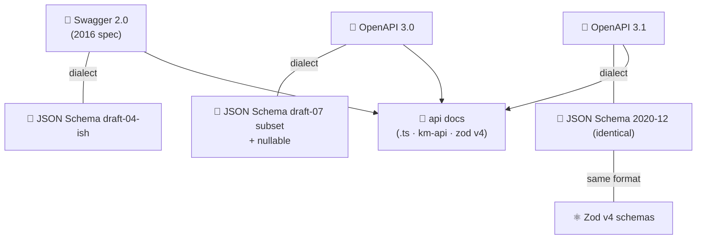

# 🧩 Concepts & Glossary

The vocabulary of this project, pinned to exact versions. If a term is used in
any other zopia document, it means what it means here.

## 📚 The big picture



> 💡 **Key fact** — OpenAPI 3.1's *Schema Object* **is** JSON Schema 2020-12
> ("the standards of openapi are the same as json schema"). That identity is
> what lets zopia treat 3.1 schemas and JSON Schema as one format.

## 📖 Terms

### 📄 Swagger 2.0

The 2016 API description format. Recognized by the top-level key
`"swagger": "2.0"`.

| 🧩 Piece | 📍 In Swagger 2.0 |
| --- | --- |
| 📐 Schemas | `definitions` (referenced as `#/definitions/X`) |
| 🌍 Hosting | `host` + `basePath` + `schemes` |
| 📦 Request bodies | a special parameter with `"in": "body"` (has `schema`) |
| 🧾 Form data | parameters with `"in": "formData"` (media type from `consumes`) |
| 🍪 Cookie parameters | ❌ none (introduced in OpenAPI 3.0) |
| 🔐 Security | `securityDefinitions` → mapped to OpenAPI 3 `securitySchemes` |
| 📐 Schema dialect | draft-04-ish subset (no `nullable`, no `const`, …) |
| 🚦 Responses | `responses` map — each response may carry a single `schema` |

### 📄 OpenAPI 3.0

Recognized by `"openapi": "3.0.x"`.

| 🧩 Piece | 📍 In OpenAPI 3.0 |
| --- | --- |
| 📐 Schemas | `components.schemas` (referenced as `#/components/schemas/X`) |
| 🌍 Hosting | `servers: [{ url, variables? }]` |
| 📦 Request bodies | dedicated `requestBody` object with a `content` map (media type → schema) |
| 🍪 Cookie parameters | ✅ `"in": "cookie"` |
| 🌗 Nullable | `nullable: true` keyword on schemas |
| 📐 Schema dialect | draft-07 **subset** + OpenAPI extensions (`nullable`, `discriminator`, `example`, `deprecated`, …) |

### 📄 OpenAPI 3.1

Recognized by `"openapi": "3.1.x"`. Same shape as 3.0, but:

- 📐 Schema dialect = **JSON Schema 2020-12** (full equality)
- 🌗 Nullability via `"type": ["string", "null"]` — `nullable` is removed
- 📸 `examples` (array) replaces `example`; `const` is allowed
- 🧮 `exclusiveMinimum/Maximum` are **numbers** (were booleans in draft-04/07)
- 🪝 adds `webhooks` (not paths — Phase 2, warning in Phase 1); path-item `$ref`s are supported when they are valid local references
- 📌 zopia treats 3.0 and 3.1 with the same normalizer + a small dialect shim

### 📐 JSON Schema

The vocabulary used to describe data shape (`type`, `properties`, `required`,
`enum`, `oneOf`, …). zopia's engine ② accepts the union of keywords found in
the three dialects above and emits warnings for anything it cannot represent
in Zod (D-12). The canonical dialect of engine ①'s output is **2020-12**.

### 🔗 $ref (reference)

A pointer like `"#/components/schemas/User"` that makes one schema *use*
another. Three shapes matter for zopia:

```jsonc
// 1️⃣  operation → component        (responses, requestBody, parameters)
{ "schema": { "$ref": "#/components/schemas/User" } }

// 2️⃣  component → component        (a part of another component)
{ "properties": { "address": { "$ref": "#/components/schemas/Address" } } }

// 3️⃣  component → itself           (cycle — always allowed, becomes z.lazy())
{ "properties": { "replies": { "type": "array", "items": { "$ref": "#/components/schemas/Comment" } } } }
```

> 📌 **Rule R-501** — zopia resolves *internal* refs only in Phase 1
> (refs must stay inside the same document). External-file refs are a
> `ZOPIA_REF_EXTERNAL` error until Phase 2.

### ⚛️ Zod v4

The schema library (validation at runtime + types at compile time). zopia
depends on Zod **v4** idioms — *not* v3 — throughout:

| 🧩 v4 feature | 📝 Used by zopia |
| --- | --- |
| `z.toJSONSchema(schema, { target })` | engine ① — built-in, no third-party converter (D-03); targets: `draft-2020-12` (default), `draft-07`, `draft-04`, `openapi-3.0` |
| `z.fromJSONSchema(schema)` | ⚠️ experimental in Zod — used **only** as a cross-check in tests, never in the output path (D-04) |
| top-level format schemas | `z.email()`, `z.uuid()`, `z.url()`, `z.hostname()`, `z.ipv4()`, `z.ipv6()` — ⚠️ each emits `format` **plus a strict `pattern`** (engine ① strips the redundant pair — R-618); `z.url()` emits `format: "uri"` |
| ISO builders | `z.iso.datetime()`, `z.iso.date()`, `z.iso.time()`, `z.iso.duration()` — ⚠️ `z.iso.time()` emits a pattern but **no `format` key** (round-trip needs the manifest overlay — R-635) |
| *(no v4 API for arbitrary formats)* | custom `format` values → `z.string()` + warning + manifest overlay preserving the format verbatim (R-627) |
| `z.enum([...])`, `z.literal(v)` | `enum` / `const` keywords |
| `z.union([...])`, `z.discriminatedUnion(key, [...])` | `oneOf` / `anyOf` (with the `discriminator` heuristic) |
| `z.intersection(a, b)` | `allOf` |
| `z.tuple([...])` | `prefixItems` / tuple `items` |
| `z.lazy(() => …)` | circular `$ref`s (R-402) |
| `.meta({ title, description, examples, … })` / `z.globalRegistry` | **all** metadata fields are copied verbatim into the JSON Schema output (verified); ⚠️ never set the `id` key — it triggers `$def` extraction |
| `z.object({…})` + `.strict()` / `.catchall(s)` / `.optional()` / `.default(v)` | objects, `additionalProperties`, `required`, `default` |
| `.min()` / `.max()` / `.int()` / `.regex()` / `.multipleOf()` | string/number/array constraints |

### 🧱 km-api

The user's endpoint-definition package — **the make function of this project's
generated code**. zopia targets **km-api `0.4.x`** and generates:

```ts
import { makeApiConfig } from 'km-api';

const getUser = makeApiConfig({
  method: 'GET',                        // 🧭 IMethod — HTTP method
  pathShape: '/admin/users/{id}',       // 🛣️ IPath — OpenAPI {param} syntax (D-05)
  auth: 'YES',                          // 🔐 'YES' | 'NO'
  requestContentType: 'application/json',
  responseContentType: 'application/json',
  summary: 'Get user by ID',            // 📝
  description: 'Retrieves …',           // 📝 (Markdown)
  tags: ['#admin', '#users'],           // 🏷️ km-api convention: '#' prefix
  request: {
    body: z.any(),                      // 📦 required field — z.any() ⇔ no body
    params: z.object({ id: z.uuid() }), // 🛣️  path params
    query: z.object({}),                // ❓
    headers: z.object({}),              // 🎩
    cookies: z.object({}),              // 🍪
  },
  response: {                           // 🚦 status code → Zod schema
    200: z.object({ id: z.uuid(), name: z.string() }),
    404: z.object({ message: z.string() }),
  },
});
```

Helper methods on the result (`makeFullPath`, `makeOpenApiPathShape`,
`convertResponseType`, …) are available to consumers for free — zopia never
needs them at generation time, and engine ④ uses `makeOpenApiPathShape()` to
normalize paths back to `{param}` form.

> 📌 **Rule R-502** — generated files import **only** `zod` and `km-api`.
> No zopia runtime is imported by generated code. Component files are
> currently generated as standalone files; endpoint component imports are not
> implemented yet, so `useComponentAsReference: true` fails explicitly.

### 📐 km-api's type surface (read from the `0.4.1` source)

`makeApiConfig` is a **type-level factory** — it does no runtime validation, so
the generated tree's contract is that it **typechecks** against km-api
≥ 0.4.1 (D-14; the golden-tree contract test enforces this, R-126):

| 🧩 Field | 📏 Accepts (km-api 0.4.1) |
| --- | --- |
| `method` (`IMethod`) | all **8** standard methods — `get/post/put/delete/head/options/patch/trace` (each case-insensitive: `GET`, `Get`, …) |
| `response` keys | standard status codes (number or string form), **any custom numeric code** (`419`, `499`, `512`, …) and the **`default`** key |
| `responseContentType` / `requestContentType` | **any** MIME type (known values still autocompleted) |
| `operationId` | any string — a real km-api field in 0.4.1; zopia emits it and reuses it as the export identifier (R-732) |

Other fixed shapes (source-verified): `ITags` = strings **prefixed with `#`**;
`IPath` = string starting with `/`; `auth`/`disable` = `'YES' | 'NO'`;
`request.body` is required (any Zod schema), `params/query/headers/cookies`
required Zod objects. The remaining km-api gaps — **per-parameter metadata**
(`style`, `explode`, `allowEmptyValue`, `deprecated`, `example`) and **response
`headers`** — have no home in km-api; zopia preserves them in the manifest
(overlay / `responseOverlay`, R-635/R-754).

> 🔗 **Where km-api lives.** zopia consumes the published `km-api@^0.4.1`
> npm package. No Git submodule or unpublished commit is required (D-15).

### 📂 api docs

The generated artifact: an `api_docs/` directory containing one `index.ts` per
endpoint (plus optional `components/**` and the manifest). Defined fully in
[API docs format](07-api-docs.md).

### 📦 .zopia-manifest.json

The hidden metadata file written into `api_docs/` (D-06). It is what makes
engine ④ lossless: exact paths & methods per file, spec identity
(kind/title/version/sha256), servers, tags, security schemes, the **full
component schemas**, **`$ref` placement** (per-API ref pointers), and
**non-representable facts** (overlay entries: titles, examples, custom
formats, unsupported keywords). See
[API docs format → The manifest](07-api-docs.md).

### 🧬 IR (internal model)

The version-independent `ApiModel` that both ③ and ④ converge on — see
[Architecture → The internal model](04-architecture.md#-the-internal-model).

### 🔁 Round-trip

For a spec `S`: `openApiToApiDocs(S) → apiDocsToOpenApi(...) ≈ S` — equal after
**canonicalization** (R-401 order, whitespace-independent JSON equality, and
documented metadata moves to the manifest). Round-trips are *tested as
properties*, not by eye (see [Testing](11-testing.md#-round-trip-property-tests)).

## ⚖️ Dialect comparison (the table that answers most "why?" questions)

| 🧩 Concern | Swagger 2.0 | OpenAPI 3.0 | OpenAPI 3.1 |
| --- | --- | --- | --- |
| 🏷️ Version key | `swagger: "2.0"` | `openapi: "3.0.x"` | `openapi: "3.1.x"` |
| 📐 Schema home | `definitions` | `components.schemas` | `components.schemas` |
| 📐 Schema dialect | draft-04-ish | draft-07 subset + extensions | **JSON Schema 2020-12** |
| 🌍 Servers | `host`+`basePath`+`schemes` | `servers[]` | `servers[]` |
| 📦 Body | param `in: body` | `requestBody.content` | `requestBody.content` |
| 🧾 FormData | param `in: formData` | `requestBody.content['multipart/…' \| 'x-www-form-urlencoded']` | same as 3.0 |
| 🍪 Cookie params | ❌ | ✅ | ✅ |
| 🌗 Nullable | ❌ no standard way (draft-04 allows type arrays, but 2.0 tooling rarely supports them) | `nullable: true` | `type: ["…", "null"]` |
| 📸 Examples | `examples` (media-type map, legacy) | `example` (single) | `examples` (array) |
| 🔐 Security | `securityDefinitions` | `components.securitySchemes` | same as 3.0 |
| 🚦 Response schema | response.schema (single) | per media type | per media type |
| 🧮 exclusiveMinimum | boolean | boolean | **number** |

> 📌 **Rule R-503** — the normalizers convert *everything* into the IR using
> the **OpenAPI-3.1-flavoured** representation (2020-12 schemas, numeric
> exclusive bounds, `type: [t, "null"]` for nullables). Dialect differences
> die at the IR boundary; they never leak into generated code.

## 🔗 Next

- 🔄 How the IR is produced and consumed → [Conversions](06-conversions.md)
- 🏗️ Where the IR lives in code → [Architecture](04-architecture.md)
