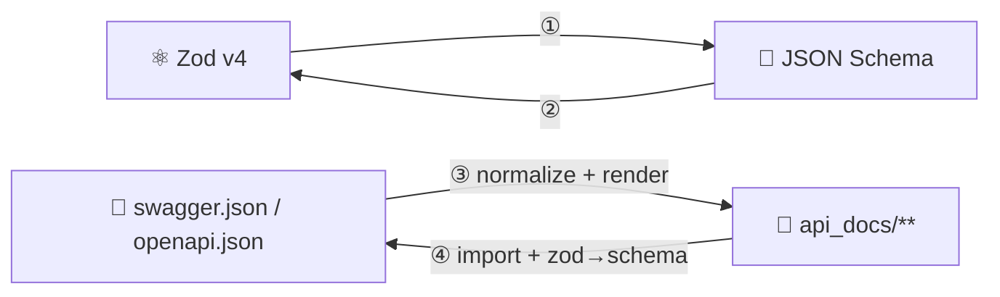

# 🔄 Conversion Engines

The four engines of zopia, pinned to exact rules. **These mapping tables are
the contract**: the implementation and the tests are written against them, and
any deviation is a bug (or a documented change to this file, in the same
commit).



> 🧭 All four engines are pure (P-3): the functions listed here take in-memory
> data and return in-memory data. File access belongs to the public wrappers
> (`openApiToApiDocs` / `apiDocsToOpenApi`).

---

## Engine ① — Zod → JSON Schema

```ts
/** ⚛️ Convert a Zod v4 schema to a JSON Schema object. */
function zodToJsonSchema(schema: $ZodType, options?: ZodToJsonSchemaOptions): JsonSchemaObject;
```

| ⚙️ Option | 📏 Type | 🆔 Default | 📝 Meaning |
| --- | --- | --- | --- |
| `target` | `'openapi-3.1' \| 'openapi-3.0' \| 'draft-2020-12' \| 'draft-07'` | `'openapi-3.1'` | dialect of the output |
| `$schema` | `boolean` | `true` | include the `$schema` URI — Zod emits it natively for the draft targets; for the `openapi-3.0` target (where Zod omits it) zopia adds `http://json-schema.org/draft-07/schema#` when enabled, removes it when disabled |
| `io` | `'input' \| 'output'` | `'output'` | Zod's native `io` param — `output` = what the schema produces; `input` = what the client sends. Engine ④ converts **request** schemas with `io: 'input'`, **response** schemas with `io: 'output'` (R-615) |

**Implementation** (D-03): a thin, deterministic layer over Zod v4's built-in
`z.toJSONSchema()`. The `zod-to-json-schema` third-party package is **not used**
(deprecated since Nov 2025 — Zod v4 is self-sufficient).

| 🎯 zopia `target` | Zod `target` param | 📝 Notes |
| --- | --- | --- |
| `openapi-3.1` | `draft-2020-12` | OpenAPI 3.1 schema objects *are* 2020-12 |
| `openapi-3.0` | `openapi-3.0` | Zod's own 3.0-compatible target (`nullable`, …) |
| `draft-2020-12` | `draft-2020-12` | pure JSON Schema |
| `draft-07` | `draft-07` | legacy consumers (closest modern dialect for Swagger 2.0-era readers) |

**Fixed behaviours**

| # | Behaviour | Rule |
| --- | --- | --- |
| R-611 | 🌗 Nullability | `z.string().nullable()` → `type: ["string", "null"]` (2020-12/3.1) or `nullable: true` (3.0 target) — whatever the target dialect prescribes |
| R-612 | 📝 Metadata | `.describe("…")` → `description`; `.meta({ … })` / `z.globalRegistry` entries → **all** metadata fields copied verbatim (`title`, `description`, `examples`, … — verified); the `id` metadata key is never emitted (it would trigger Zod's `$def` extraction) |
| R-613 | 🌀 Cycles | Zod's `cycles: "ref"` handling — recursive schemas become `$defs` + `$ref` |
| R-614 | 🚫 Unrepresentable | Zod's official unrepresentable list: `z.bigint()`, `z.int64()`, `z.symbol()`, `z.undefined()`, `z.void()`, `z.date()`, `z.map()`, `z.set()`, `z.transform()`, `z.nan()`, `z.custom()`, `z.number().multipleOf(0)` — all become `{}` **plus a `ZopiaWarning`** (never a throw, R-408; Zod's own default is to throw). ⚠️ `z.void()` is special-cased *before* conversion in engine ④ for 204-style no-content responses (R-654) |
| R-615 | 🔄 io semantics | default conversion represents the **output** type. zopia converts **request** schemas with `io: 'input'` (what the client sends — defaulted request fields stay *optional*, so source `required`/`default` round-trip exactly) and **response** schemas with the default `io: 'output'`. For transforms/pipes, `io` selects the side |
| R-616 | 🗺️ Records/maps | `z.record(k, v)` → `{"type":"object","additionalProperties": v}` plus `propertyNames` when `k` is a constrained schema (Zod's native shape); `z.map(k, v)` — and `z.set(v)` — are **unrepresentable** (R-614: `{}` + warning; Zod throws for both by default) |
| R-617 | 📏 Key order | canonical (R-401): `type` first, then keywords in a fixed dictionary order — byte-stable output (zopia re-sorts Zod's emission order) |
| R-618 | 🧹 Redundancy stripping | Zod emits built-in format schemas with a strict companion `pattern`, and `z.number().int()` with sentinel bounds `minimum: -9007199254740991` / `maximum: 9007199254740991` (±(2⁵³−1)). ① **strips** (a) `pattern` when paired with a known built-in `format` (`uuid`, `email`, `hostname`, `ipv4`, `ipv6`, `date-time`, `date`, `duration`, `uri`), and (b) each sentinel bound whenever present (independently). Custom patterns (`z.string().regex(…)` — no `format`) and real user bounds are kept. This is what keeps ① output spec-clean and round-trips exact |

**Example**

```ts
const user = z.object({
  id: z.uuid(),
  name: z.string().min(1).describe('Display name'),
  email: z.email(),
  role: z.enum(['admin', 'editor', 'viewer']).default('viewer'),
});

zodToJsonSchema(user, { target: 'openapi-3.1' });
// ↓
{
  $schema: 'https://json-schema.org/draft/2020-12/schema',
  type: 'object',
  properties: {
    id: { type: 'string', format: 'uuid' },
    name: { type: 'string', minLength: 1, description: 'Display name' },
    email: { type: 'string', format: 'email' },
    role: { type: 'string', enum: ['admin', 'editor', 'viewer'], default: 'viewer' },
  },
  required: ['id', 'name', 'email', 'role'],
  additionalProperties: false,
}
// ⤴ output-side semantics: Zod puts defaulted keys in `required`
//   (role has a default but is always present in the output).
//   Request schemas are converted with io: 'input' instead (R-615):
zodToJsonSchema(user, { target: 'openapi-3.1', io: 'input' });
// → required: ['id', 'name', 'email']  (role stays optional, default kept)
```

---

## Engine ② — JSON Schema → Zod

```ts
/** 📐 Convert a JSON Schema object (or .json file path) to Zod v4 code. */
function jsonSchemaToZod(schema: JsonSchemaObject | string, options?: JsonSchemaToZodOptions): JsonSchemaToZodResult;

interface JsonSchemaToZodResult {
  /** 📝 TypeScript source — Zod v4 code, ready to paste into api_docs. */
  code: string;
  /** ⚙️ Runtime equivalent of `code` (built by the same emitter). */
  schema: $ZodType;
  /** ⚠️ Every lossy/unsupported conversion (R-408 / D-12). */
  warnings: ZopiaWarning[];
}
```

**Implementation** (D-04): a custom recursive emitter. Zod's experimental
`z.fromJSONSchema()` is *not* the output path (experimental status) — it is
used in tests as an independent cross-check.

### 🔁 The keyword map (the contract)

| 📐 JSON Schema | ⚛️ Zod v4 emitted | 🆔 Rule |
| --- | --- | --- |
| `{ "type": "string" }` | `z.string()` | R-621 |
| `{ "type": "integer" }` | `z.number().int()` | R-621 |
| `{ "type": "number" }` | `z.number()` | R-621 |
| `{ "type": "boolean" }` | `z.boolean()` | R-621 |
| `{ "type": "null" }` | `z.null()` | R-621 |
| `{ "type": "array", "items": S }` | `z.array(⟦S⟧)` | R-622 |
| `{ "type": "array", "items": [A, B] }` *(tuple, draft-04/07)* | `z.tuple([⟦A⟧, ⟦B⟧])` | R-622 |
| `{ "type": "array", "prefixItems": [A, B] }` *(2020-12 tuple)* | `z.tuple([⟦A⟧, ⟦B⟧])` | R-622 |
| `{ "type": "object", "properties": P, "required": R }` | `z.object({…})` — keys in `R` plain, others `.optional()` | R-623 |
| `{}` or annotations without `type` | `z.any()` | R-624 |
| object-, array-, string-, or numeric-only keywords without `type` | intersection of applicable-type unions: each constrained matching type plus unconstrained non-matching JSON types, preserving JSON Schema keyword applicability | R-624 |
| `{ "type": ["string", "null"] }` *(3.1/2020-12 nullable)* | `⟦string⟧.nullable()` | R-625 |
| `{ "nullable": true }` *(3.0)* | `⟦…⟧.nullable()` | R-625 |
| `{ "enum": ["a", "b"] }` | `z.enum(['a', 'b'])` (string enums — round-trips exactly) | R-626 |
| `{ "enum": [1, 2] }` / mixed | `z.union([z.literal(1), z.literal(2)])` — ⚠️ ① expands this to `anyOf` of `const` nodes; engine ④'s serializer re-emits it as `enum` (R-654) | R-626 |
| `{ "const": v }` | `z.literal(v)` | R-626 |
| `{ "format": "email" \| "uuid" \| "hostname" \| "ipv4" \| "ipv6" \| "date-time" \| "date" \| "duration" }` | `z.email()` / `z.uuid()` / `z.hostname()` / `z.ipv4()` / `z.ipv6()` / `z.iso.datetime()` / `z.iso.date()` / `z.iso.duration()` — all round-trip exactly (① strips Zod's companion `pattern`, R-618) | R-627 |
| `{ "format": "uri" \| "url" }` | `z.url()` — Zod emits `format: "uri"`; when the source said `"url"` an overlay entry restores the exact original alias (R-635) | R-627 |
| `{ "format": "time" }` | `z.iso.time()` — ⚠️ Zod emits a pattern but **no** `format` key; overlay entry restores `{ "format": "time" }` and removes the pattern (R-635) | R-627 |
| `{ "format": "byte" }` *(Swagger 2.0 — base64)* | `z.base64()` — Zod emits `format: "base64"` + `contentEncoding` + pattern; overlay restores `format: "byte"` and removes the extras (R-635) | R-627 |
| `{ "format": "<other>" }` on **any** base type | any format without an explicit row above (`password`, `binary`, `int32`, `int64`, `float`, `double`, `uri-reference`, `regex`, `decimal`, `json-pointer`, …) → the **base type without the format** + warning `ZOPIA_WARN_CUSTOM_FORMAT` + overlay restoring the format verbatim (R-635). For `type: integer` with `int64`: `z.number().int()` + warning `ZOPIA_WARN_INT64` (safe-integer approximation — JS has no 64-bit int) | R-627 |
| `{ "minimum": n }` / `{ "maximum": n }` | `.min(n)` / `.max(n)` | R-628 |
| `{ "exclusiveMinimum": n }` *(number — 2020-12/3.1)* | `.gt(n)` — round-trips exactly (Zod emits numeric `exclusiveMinimum`) | R-628 |
| `{ "exclusiveMinimum": true }` *(boolean — draft-04/07)* | `.gt(n)` over `minimum` for numbers; `.min(n + 1)` for integers — **plus warning** `ZOPIA_WARN_LEGACY_EXCLUSIVE_BOUND` + overlay restoring the original boolean form (R-635) | R-628 |
| `{ "minLength": n }` / `{ "maxLength": n }` | `.min(n)` / `.max(n)` on strings | R-628 |
| `{ "pattern": p }` | `.regex(new RegExp(p))` | R-628 |
| `{ "multipleOf": n }` | `.multipleOf(n)` | R-628 |
| `{ "minItems": n }` / `{ "maxItems": n }` | array `.min(n)` / `.max(n)` | R-628 |
| `{ "uniqueItems": true }` | ⚠️ no Zod equivalent → **warning** `ZOPIA_WARN_UNIQUE_ITEMS` + plain array + overlay `set: { "uniqueItems": true }` (restored verbatim on reverse) | D-12 |
| `{ "default": v }` (on optional) | `.default(v)` | R-629 |
| `{ "required": [...] }` | keys listed are non-optional | R-623 |
| `{ "additionalProperties": false }` | `z.object({…}).strict()` | R-630 |
| `{ "additionalProperties": S }` | `z.object({…}).catchall(⟦S⟧)` | R-630 |
| `{ "additionalProperties": true }` *(or absent)* | plain `z.object({…})` | R-630 |
| `{ "dependencies": { "a": ["b"] } }` *(draft-04/06/07)* | object refinement requiring `b` whenever `a` is present | R-630 |
| `{ "dependencies": { "a": S } }` *(draft-04/06/07)* | object refinement applying schema `S` whenever `a` is present; boolean schemas are supported | R-630 |
| `{ "oneOf": [A, B, …] }` | `z.union([⟦A⟧, ⟦B⟧, …])` | R-631 |
| `{ "oneOf": […], "discriminator": {"propertyName": k} }` | `z.discriminatedUnion(k, [⟦…⟧])` — every member must be an object with a literal/enum at `k`, otherwise fall back to `z.union` + warning; the `discriminator` keyword itself is restored by an overlay entry (R-635) | R-631 |
| `{ "anyOf": […] }` | `z.union([…])` | R-631 |
| `{ "allOf": [A, B, …] }` | `z.intersection(⟦A⟧, ⟦B⟧, …)` (left-fold) — ⚠️ ① flattens object intersections into one object (structural loss) → overlay `node` entry freezes the original `allOf` subtree verbatim (R-635/R-659) | R-632 |
| `{ "not": S }` | ⚠️ no Zod equivalent → `z.any()` + warning `ZOPIA_WARN_NOT` + overlay `node` (original subtree verbatim) | D-12 |
| `{ "$schema": … } / { "$id": … } / { "$comment": … }` | ignored (document annotations; no Zod home) | R-636 |
| `{ "title": t }` / `{ "description": d }` / `{ "example": v }` / `{ "examples": […] }` | a single `.meta({ title?, description?, examples? })` call on the schema (only the fields present) — verified copied verbatim back by ① (R-612), plus a JSDoc comment for human readers. `example` (single) is normalized to `examples: [v]` | R-633 |
| `{ "$ref": "#/…/schemas/X" }` | component mode: import `XSchema`; default mode: local const (R-403) | R-402/R-634 |
| `{ "$defs": { … } }` / `{ "definitions": { … } }` | file-local consts, in definition order | R-634 |
| `{ "if": I, "then": T, "else": E }` | base schema plus a refinement that validates `T` when `I` succeeds and `E` otherwise; boolean branches and exact keyword-only applicability are supported, while malformed/detached branches warn | R-632 |
| `{ "patternProperties": … }` / `{ "propertyNames": … }` / `{ "minProperties": n }` / `{ "maxProperties": n }` / `{ "contains": … }` | ⚠️ nearest approximation (`z.record(z.string(), z.unknown())` where sensible) + warnings + overlay `node` for the unsupported keywords | D-12 |

> ⟦S⟧ = "the Zod code of the sub-schema S" (recursion).

> 📌 **Rule R-635** — *overlay recording.* Every ② mapping that is not
> round-trip-identity records a **manifest overlay entry** preserving the
> original keywords verbatim, so engine ④ can restore them. Overlay entry:
> `{ at: <JSON pointer>, set?: <keywords>, remove?: <keys>, node?: <sub-tree> }` —
> `set`/`remove` for surgical keyword restoration (format aliases, `time`,
> boolean exclusive bounds, `discriminator`, `uniqueItems`), `node` for
> structural freezes (`allOf`-of-objects, `not`, `if/then/else`,
> `patternProperties`, … — each emits warning `ZOPIA_WARN_FROZEN_SUBTREE`).
> A schema with no lossy keywords produces **no** overlay entries — the
> canonical Admin API fixture asserts exactly that.

### 📏 Emitted code style (fixed)

| 📏 Rule | Example |
| --- | --- |
| 2-space indent, single quotes, semicolons, trailing newline | — |
| one chainable check per line when a schema has **> 2** checks (readability) | `z.string().min(1).max(100)` stays one line; three+ → multi-line |
| consts are `PascalCase + 'Schema'` for components, `camelCase` for locals | `UserSchema`, `error`, `pageParam` |
| identical sub-schemas dedupe within a file (R-403) | one `const error`, used by 401 *and* 404 |
| circular refs → `z.lazy(() => XSchema)` (R-402) | — |
| warnings mirrored as `// @zopia:warn <CODE> <keyword> — <message>` comments at the exact node | — |

**Example**

```ts
jsonSchemaToZod({
  type: 'object',
  required: ['name', 'email'],
  properties: {
    name:  { type: 'string', minLength: 1 },
    email: { type: 'string', format: 'email' },
    role:  { type: 'string', enum: ['admin', 'editor', 'viewer'], default: 'viewer' },
    id:    { type: 'string', format: 'uuid' },
  },
});
// ↓ code  (rootName default: 'schema' — see Configuration)
`
const schema = z.object({
  name: z.string().min(1),
  email: z.email(),
  role: z.enum(['admin', 'editor', 'viewer']).default('viewer'),
  id: z.uuid().optional(),
});
`
```

---

## Engine ③ — OpenAPI → api docs

```ts
/** 📄 Generate the api_docs tree from a spec (JSON object or file path). */
function openApiToApiDocs(input: string | Record<string, unknown>, options?: ZopiaGenerateOptions): Promise<ZopiaGenerateResult>;
```

Pipeline (see [Architecture → The pipeline](04-architecture.md#-the-pipeline)):
**detect → normalize (v2 | v3) → refs → render (directory | flat) → manifest**.

### 🔍 Step 1 — detect

| 🧾 Top-level | 🏷️ Kind |
| --- | --- |
| `swagger === '2.0'` | `openapi-2.0` |
| `openapi === '3.0.x'` | `openapi-3.0` |
| `openapi === '3.1.x'` | `openapi-3.1` |
| anything else | 🛑 `ZOPIA_SPEC_UNSUPPORTED_VERSION` |

Missing `paths` → `ZOPIA_SPEC_MISSING_PATHS`. Invalid JSON → `ZOPIA_SPEC_INVALID_JSON`.

### 🔧 Step 2 — normalize (the dialect tables)

#### Swagger 2.0 → IR

| 📐 Swagger 2.0 | 🧬 IR |
| --- | --- |
| `definitions` | `components` (R-503: 2020-12-flavoured) |
| `host` + `schemes[0]` + `basePath` | `servers: [ "<scheme>://<host><basePath>" ]` (or `[basePath]` / `['/']` without host) |
| parameter `in: body` | `request.body` = its `schema`; `requestContentType` from operation `consumes` (else global) |
| parameters `in: formData` | `request.body` = object of the formData params (`required` flags kept); `requestContentType` = `multipart/form-data` if in `consumes`, else `application/x-www-form-urlencoded` |
| parameters `in: query/header/path` | `request.query/headers/params` — primitive params (`type`, `format`, `enum`, …) become their `schema`; `type: integer, format: int32/int64` → `{ "type": "integer" }` (`int64` → + warning `ZOPIA_WARN_INT64`) |
| operation/global `consumes` | `requestContentType` (first JSON-ish type wins; else first) |
| operation/global `produces` | `responseContentType`; each response's single `schema` → `response.statuses[].schema` under that media type |
| response `examples` (media-type → single value, the legacy shape) | wrapped as one `default`-named example under the primary media type |
| `securityDefinitions` (basic/apiKey/oauth2) | `securitySchemes` (OpenAPI 3 shapes) |
| `security` (op or global) | op-level `security` / global `defaultSecurity` (verbatim requirement lists) + `auth: 'YES'` where a requirement applies (explicit `security: []` ⇒ `auth: 'NO'`) |
| `deprecated: true` | `deprecated: true` |
| `basePath` / version | manifest `source` + `servers` |

#### OpenAPI 3.0/3.1 → IR

| 📐 OpenAPI 3.x | 🧬 IR |
| --- | --- |
| `components.schemas` | `components` |
| `servers[].url` (variables ignored in Phase 1 + warning `ZOPIA_WARN_SERVER_VARIABLES`) | `servers` |
| `requestBody.content` | primary media type (R-641) → `request.body` + `requestContentType`; others recorded in manifest |
| parameters `in: path/query/header/cookie` | `request.params/query/headers/cookies` |
| `responses` (per media type) | `response.statuses[]` — primary media type per response (R-641); description required by spec → kept |
| `nullable: true` *(3.0)* | `type: [t, "null"]` in the IR (R-503) |
| `exclusiveMinimum/Maximum` boolean *(3.0)* | numeric form + warning (R-628) |
| `components.securitySchemes` | `securitySchemes` |
| `security` (op or global) | op-level `security` / global `defaultSecurity` (verbatim requirement lists) + `auth: 'YES'` where a requirement applies (explicit `security: []` ⇒ `auth: 'NO'`) |
| `example` (single) | `examples` single-name map |
| the `default` response & non-standard codes (`419`, `499`, `512`, …) | emitted verbatim as the `default` / numeric response keys (km-api ≥ 0.4.1 accepts both) |
| parameter extras (`allowEmptyValue`, `style`, `explode`, `deprecated`, `example`) | no home in Zod/km-api → overlay entries on the operation subtree pointers (R-635) |
| response `headers` | no home in km-api → `apis[].responseOverlay` entries (re-emitted verbatim, R-654c) |
| 3.1 `webhooks` object | skipped + warning `ZOPIA_WARN_WEBHOOKS` (Phase 2) |
| path item that is a local `$ref` | resolve the local JSON Pointer (including chained references); external, missing, malformed, and circular references are rejected |
| `deprecated: true` | `deprecated: true` |

> 📌 **Rule R-641** — *primary media type*: when a `content` map has several
> entries, `application/json` wins; otherwise the first key in document order.
> Non-primary media types are recorded in the manifest and produce warning
> `ZOPIA_WARN_MULTI_CONTENT`.
>
> 📌 **Rule R-642** — *the km-api 0.4.1 contract.* zopia **requires km-api ≥
> 0.4.1**: `makeApiConfig` is a type-level factory (no runtime validation), so
> the generated tree must **typecheck** against km-api 0.4.x (D-14; the
> golden-tree contract test enforces this, R-126). km-api 0.4.1's open type
> surface — all 8 methods (incl. `trace`), any custom numeric status code and
> the `default` key, any MIME type, `operationId` — means **every practical
> API fact is emitted as code**. The remaining km-api gaps (per-parameter
> metadata, response `headers`) are preserved in the manifest (overlay /
> `apis[].responseOverlay`, R-635/R-754).

### 🔗 Step 3 — refs

Per [Architecture → The reference graph](04-architecture.md#-the-reference-graph)
(R-402): unknown → `ZOPIA_REF_NOT_FOUND`; external → `ZOPIA_REF_EXTERNAL`;
cycles → `z.lazy` plan. Refs to **non-schema** reusable objects (global
`parameters`/`responses` in 2.0, `components.parameters/responses/examples`
in 3.x) are **inlined at their use sites** during normalization (Phase 1) —
they never enter the graph (R-402 scope).

### 🖨️ Step 4 — render

Lays out files per the mode and emits code:

- 📂 layout — [API docs format](07-api-docs.md) (trees, naming, collisions)
- 📄 endpoint files — the **`index.ts` contract** ([07 → contract](07-api-docs.md#-the-indexts-contract)); every *practical* field of `makeApiConfig` is filled from the IR when the source provides it (T-7)
- 🧱 components — [Components](08-components.md)
- 📦 manifest — [07 → The manifest](07-api-docs.md)

**Result**

```ts
interface ZopiaGenerateResult {
  /** 📂 Every file written, relative to outDir, sorted (R-401). */
  files: Array<{ path: string; kind: 'endpoint' | 'component' | 'manifest' }>;
  /** ⚠️ All warnings (R-408). */
  warnings: ZopiaWarning[];
  /** 📦 Manifest path relative to outDir. */
  manifestPath: string;
}
```

---

## Engine ④ — api docs → OpenAPI

```ts
/** 📦 Documented directory-level API; defaults to OpenAPI 3.1. */
function apiDocsToOpenApi(path: string, options?: ZopiaReverseOptions): Promise<{ openapi: Record<string, unknown>; warnings: string[] }>;

/** 📦 Low-level snapshot helper; omission preserves the manifest source dialect. */
function manifestToOpenApi(manifest: ZopiaManifest, options?: ZopiaReverseOptions): Record<string, unknown>;
function manifestFileToOpenApi(file: string, options?: ZopiaReverseOptions): Promise<Record<string, unknown>>;

interface ZopiaReverseOptions { version?: '3.0' | '3.1' }

interface ZopiaManifest {
  $schema: 'zopia:manifest@1';
  source: { kind: string; title: string; version: string };
  components?: Array<{ name: string; file: string | null; schema: unknown }>;
  apis: Array<{ file: string; path: string; method: string; sourceOperation?: Record<string, unknown>; refs?: Array<{ at: string; ref?: string; component?: string }>; overlay?: Array<{ at?: string; set?: Record<string, unknown>; remove?: string[]; node?: unknown; key?: string; value?: unknown }>; responseOverlay?: unknown }>;
}
```

`manifestFileToOpenApi()` imports each trusted `apis[].file` and every emitted `components[].file` relative to the manifest. Runtime km-api metadata and edited request/response Zod schemas override their manifest snapshots; request-side schemas use Engine ① input semantics, response-side schemas use output semantics, and imported component references remain `$ref`s. A manifest `$ref` never replaces a different component selected in the runtime schema. Passing `version: '3.0' | '3.1'` selects both the document envelope and Engine ① schema target; Swagger source operations and reusable objects are normalized to the selected OpenAPI 3 dialect. `apiDocsToOpenApi()` supplies the documented 3.1 default, while the low-level manifest helpers preserve the source dialect when options are omitted for snapshot/backward compatibility. `manifestToOpenApi()` remains synchronous and never imports files.

| # | Step | Rules |
| --- | --- | --- |
| R-651 | 📦 **Manifest required** | no `.zopia-manifest.json` → `ZOPIA_DOCS_MISSING_MANIFEST`; a missing file field or a missing/renamed endpoint or emitted-component file → `ZOPIA_DOCS_MANIFEST_MISMATCH`. All listed paths are preflighted (including containment and regular-file checks) before any generated module is imported, so a stale manifest cannot partially execute the tree. (The manifest is what makes flat mode unambiguous — D-06.) |
| R-652 | 🧬 **Trusted import** (D-08) | each `apis[].file` is imported at runtime (Bun executes the `.ts`). The module must export a `makeApiConfig` result — default or named; otherwise `ZOPIA_DOCS_IMPORT_FAILED`. |
| R-653 | 🧩 **Extraction** | from the config result: `method`, `pathShape → makeOpenApiPathShape()` (guarantees `{param}` form; identity on already-OpenAPI paths), `summary`, `description`, `operationId`, `tags` (strip `#`), `auth` (`'YES' | 'NO'`), `deprecated === 'YES'` → `deprecated: true`; `disable` remains an independent status field, `requestContentType`/`responseContentType` (the actual media types — km-api 0.4.1's open unions), `examples`. Edited media types replace the former selected media entry rather than retaining its stale manifest schema; runtime examples likewise replace `example`/`examples` snapshots. The operation's **`security` requirement** comes from the manifest, not the config (km-api stores only the `auth` status): `apis[].security` when present, else the top-level `defaultSecurity` — see R-656. Response keys — incl. custom codes and `default` — come straight from the config; response `headers` arrive via `apis[].responseOverlay`. |
| R-654 | 📐 **Schemas** | every request/response Zod schema → engine ① with `target: version === '3.0' ? 'openapi-3.0' : 'openapi-3.1'`; **request** schemas with `io: 'input'`, **response** schemas with `io: 'output'` (R-615) — so defaulted request fields naturally stay out of `required`. `z.any()` body → no `requestBody`. `z.void()` responses are detected **before** engine ① (Zod lists `z.void()` as unrepresentable — it would become `{}` + warning) → no `content` (e.g. 204). Empty `z.object({})` in params/query/headers/cookies → omitted. Swagger form-data is changed to a body parameter when code changes the request media type away from a form media type; cookie parameters and non-body object/reference schemas fail explicitly because Swagger 2.0 cannot represent them. The serializer then applies **value normalizations**: (a) drop sentinel safe-integer bounds (R-618), (b) re-emit const-literal `anyOf`/`oneOf` as `enum` (inverse of Zod's expansion), (c) `apis[].responseOverlay` entries (response `headers`) are re-emitted verbatim into the matching `responses` entry. |
| R-655 | 🧱 **Components** | the manifest **always** lists schema components (name, full `schema`, `file: <path> \| null`) and preserves other OpenAPI component sections in `componentsOverlay`; Swagger reusable `parameters` and `responses` are retained separately. `file` set (components mode): the component file is imported and converted — developer edits win. `file: null` (default mode): the manifest `schema` is re-emitted verbatim. File-based endpoint use-sites become `$ref`s from imported Zod identities; snapshot ref pointers never overwrite a developer-selected component (R-752). |
| R-656 | 🔐 **Security** | `securitySchemes` **and the requirement lists** (top-level `defaultSecurity`, per-operation `apis[].security`) restored from the manifest — an operation emits its own `security` key iff `apis[].security` is present (an explicit `[]` is re-emitted as `security: []`), otherwise the global `security` is re-emitted from `defaultSecurity`. If an operation has `auth: YES` but the manifest records no requirement (e.g. a hand-edited tree) → a default `bearerAuth` (http/bearer) scheme **and** requirement are added **plus warning** `ZOPIA_WARN_DEFAULT_SECURITY`. |
| R-657 | 🏷️ **Document frame** | `info` from the manifest `source` (title/version/description); `servers`, `tags` from the manifest; fallbacks (`title: 'Zopia API'`, `version: '0.0.0'`) + warning when the manifest lacks them. |
| R-658 | 📏 **Shape** | `version: '3.0'` emits `openapi: '3.0.0'` with OpenAPI 3.0 schemas; `version: '3.1'` emits `openapi: '3.1.0'` with JSON Schema 2020-12 semantics. The directory-level API and CLI default to 3.1 (D-09); invalid versions fail with `ZOPIA_CONFIG_INVALID` before generated code is imported. Translation preserves nullable refs, literal annotation data, effective exclusive bounds, and every Swagger `consumes`/`produces` media type; 3.1-only `webhooks`, `jsonSchemaDialect`, and `components.pathItems` are omitted from 3.0. Swagger 2.0 output itself remains Phase 2. |
| R-659 | 🩹 **Refs & overlays applied last** | after Zod serialization, file-backed conversion restores each `apis[].refs` entry at its RFC 6901 pointer, then applies schema overlays (`set`/`remove` or frozen `node`), operation overlays, and `responseOverlay`. A source ref is not restored when runtime code already points at a different component, and overlays beneath that skipped ref are skipped too; developer-selected reference changes therefore win. Response overlays restore non-schema response facts without replacing code-derived `content`, Swagger `schema`, or examples. |

### 🔁 Why the round-trip closes

Two sources of truth, one rule each:

| 📦 Source | Carries |
| --- | --- |
| 📄 **the generated code** | schema *content* — what developers may edit. Converted back by engine ① + serializer normalizations (R-654) |
| 📦 **the manifest** | *placement & non-representable facts* — full component schemas, `$ref` pointers (`refs`), keyword-level restorations (`overlay`: format aliases, `time`, boolean exclusive bounds, `discriminator`, `uniqueItems`, parameter extras, …) and frozen subtrees (`overlay.node`: `allOf`-of-objects, `not`, `if/then/else`, `patternProperties`, …), km-api-less response facts (`apis[].responseOverlay`: response `headers` — R-754), plus the document frame (info, servers, tags, security schemes, security requirements, non-primary media types, titles, examples) |

Engine ④ applies them in the fixed order **convert → refs → schema/operation overlay → response overlay**
(R-659). The union reproduces the original document; the only remaining
difference is key order, which canonicalization (R-401) resolves. That is
tested as a property for every fixture
([Testing](11-testing.md#-round-trip-property-tests)).

### ⚠️ Honest limits (documented, warned, manifest-recorded)

| 🧩 Fact | What happens |
| --- | --- |
| `title`, `example(s)` | manifest → re-emitted verbatim |
| non-primary media types | manifest → re-emitted as extra `content` entries |
| keyword-level losses (`uniqueItems`, `discriminator`, `time`/`url` formats, boolean exclusive bounds, custom formats) | overlay `set`/`remove` → restored verbatim (R-635) |
| structural losses (`allOf`-of-objects, `not`, `if/then/else`, `patternProperties`, …) | overlay `node` → **frozen subtree** restored verbatim + warning `ZOPIA_WARN_FROZEN_SUBTREE` — code edits to a frozen subtree do not propagate in Phase 1 (documented in the generated comment) |
| parameter extras (`allowEmptyValue`, `style`, `explode`, …) & response `headers` — no home in km-api (R-642) | overlay / `apis[].responseOverlay` → restored verbatim |
| 3.1 `webhooks` | warning (Phase 1 drops them + `ZOPIA_WARN_WEBHOOKS`) |
| server `variables` | warning (Phase 1 drops them + `ZOPIA_WARN_SERVER_VARIABLES`) |

## 🔗 Next

- 📂 Where every file lands → [API docs format](07-api-docs.md)
- 🧱 Component options in depth → [Components](08-components.md)
