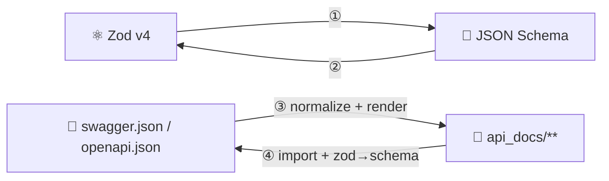

# 🔄 Conversion Engines

The four engines of zopia, pinned to exact rules. **These mapping tables are
the contract**: the implementation and the tests are written against them, and
any deviation is a bug (or a documented change to this file, in the same
commit).



> 🧭 All four engines are pure (P-3): the functions listed here take in-memory
> data and return in-memory data. File access belongs to the public wrappers
> (`openApiToApiDocs` / `apiDocsToOpenApi`).

---

## ️ Engine ① — Zod → JSON Schema

```ts
/** ⚛️ Convert a Zod v4 schema to a JSON Schema object. */
function zodToJsonSchema(schema: $ZodType, options?: ZodToJsonSchemaOptions): JsonSchemaObject;
```

| ⚙️ Option | 📏 Type | 🆔 Default | 📝 Meaning |
| --- | --- | --- | --- |
| `target` | `'openapi-3.1' \| 'openapi-3.0' \| 'draft-2020-12' \| 'draft-07'` | `'openapi-3.1'` | dialect of the output |
| `$schema` | `boolean` | `true` | include the `$schema` identifier |

**Implementation** (D-03): a thin, deterministic layer over Zod v4's built-in
`z.toJSONSchema()`. The `zod-to-json-schema` third-party package is **not used**
(deprecated since Nov 2025 — Zod v4 is self-sufficient).

| 🎯 zopia `target` | Zod `target` param | 📝 Notes |
| --- | --- | --- |
| `openapi-3.1` | `draft-2020-12` | OpenAPI 3.1 schema objects *are* 2020-12 |
| `openapi-3.0` | `openapi-3.0` | Zod's own 3.0-compatible target (`nullable`, …) |
| `draft-2020-12` | `draft-2020-12` | pure JSON Schema |
| `draft-07` | `draft-07` | legacy consumers (closest modern dialect for Swagger 2.0-era readers) |

**Fixed behaviours**

| # | Behaviour | Rule |
| --- | --- | --- |
| R-611 | 🌗 Nullability | `z.string().nullable()` → `type: ["string", "null"]` (2020-12/3.1) or `nullable: true` (3.0 target) — whatever the target dialect prescribes |
| R-612 | 📝 Metadata | `.describe("…")` → `description`; metadata registered via the Zod registry → `title`/`description` |
| R-613 | 🌀 Cycles | Zod's `cycles: "ref"` handling — recursive schemas become `$defs` + `$ref` |
| R-614 | 🚫 Unrepresentable | `unrepresentable: "any"` — functions/transforms/NaNs become `{}` **plus a `ZopiaWarning`** (never a throw, R-408) |
| R-615 | 🧮 Transform/pipe | the **input** side of the schema is converted (documented limitation — matches what validators see) |
| R-616 | 🗺️ Maps/sets | `z.map(k, v)` → `{"type":"object","additionalProperties": v}`; `z.set(v)` → `{"type":"array","items": v, "uniqueItems": true}` |
| R-617 | 📏 Key order | canonical (R-401): `type` first, then keywords in a fixed dictionary order — byte-stable output |

**Example**

```ts
const user = z.object({
  id: z.uuid(),
  name: z.string().min(1).describe('Display name'),
  email: z.email(),
  role: z.enum(['admin', 'editor', 'viewer']).default('viewer'),
});

zodToJsonSchema(user, { target: 'openapi-3.1' });
// ↓
{
  $schema: 'https://json-schema.org/draft/2020-12/schema',
  type: 'object',
  properties: {
    id: { type: 'string', format: 'uuid' },
    name: { type: 'string', minLength: 1, description: 'Display name' },
    email: { type: 'string', format: 'email' },
    role: { type: 'string', enum: ['admin', 'editor', 'viewer'], default: 'viewer' },
  },
  required: ['id', 'name', 'email'],
  additionalProperties: false,
}
```

---

## ️ Engine ② — JSON Schema → Zod

```ts
/** 📐 Convert a JSON Schema object (or .json file path) to Zod v4 code. */
function jsonSchemaToZod(schema: JsonSchemaObject | string, options?: JsonSchemaToZodOptions): JsonSchemaToZodResult;

interface JsonSchemaToZodResult {
  /** 📝 TypeScript source — Zod v4 code, ready to paste into api_docs. */
  code: string;
  /** ⚙️ Runtime equivalent of `code` (built by the same emitter). */
  schema: $ZodType;
  /** ⚠️ Every lossy/unsupported conversion (R-408 / D-12). */
  warnings: ZopiaWarning[];
}
```

**Implementation** (D-04): a custom recursive emitter. Zod's experimental
`z.fromJSONSchema()` is *not* the output path (experimental status) — it is
used in tests as an independent cross-check.

### 🔁 The keyword map (the contract)

| 📐 JSON Schema | ⚛️ Zod v4 emitted | 🆔 Rule |
| --- | --- | --- |
| `{ "type": "string" }` | `z.string()` | R-621 |
| `{ "type": "integer" }` | `z.number().int()` | R-621 |
| `{ "type": "number" }` | `z.number()` | R-621 |
| `{ "type": "boolean" }` | `z.boolean()` | R-621 |
| `{ "type": "null" }` | `z.null()` | R-621 |
| `{ "type": "array", "items": S }` | `z.array(⟦S⟧)` | R-622 |
| `{ "type": "array", "items": [A, B] }` *(tuple, draft-04/07)* | `z.tuple([⟦A⟧, ⟦B⟧])` | R-622 |
| `{ "type": "array", "prefixItems": [A, B] }` *(2020-12 tuple)* | `z.tuple([⟦A⟧, ⟦B⟧])` | R-622 |
| `{ "type": "object", "properties": P, "required": R }` | `z.object({…})` — keys in `R` plain, others `.optional()` | R-623 |
| *(no `type`, or `{}`)* | `z.unknown()` | R-624 |
| `{ "type": ["string", "null"] }` *(3.1/2020-12 nullable)* | `⟦string⟧.nullable()` | R-625 |
| `{ "nullable": true }` *(3.0)* | `⟦…⟧.nullable()` | R-625 |
| `{ "enum": ["a", "b"] }` | `z.enum(['a', 'b'])` (string enums) | R-626 |
| `{ "enum": [1, 2] }` / mixed | `z.union([z.literal(1), z.literal(2)])` | R-626 |
| `{ "const": v }` | `z.literal(v)` | R-626 |
| `{ "format": "email" }` | `z.email()` | R-627 |
| `{ "format": "uuid" }` | `z.uuid()` | R-627 |
| `{ "format": "uri" \| "url" }` | `z.url()` | R-627 |
| `{ "format": "hostname" }` | `z.hostname()` | R-627 |
| `{ "format": "ipv4" \| "ipv6" }` | `z.ipv4()` / `z.ipv6()` | R-627 |
| `{ "format": "date-time" }` | `z.iso.datetime()` | R-627 |
| `{ "format": "date" \| "time" \| "duration" }` | `z.iso.date()` / `z.iso.time()` / `z.iso.duration()` | R-627 |
| `{ "format": "<other>" }` | `z.string().openFormat('<other>')` — **preserved** for round-trip | R-627 |
| `{ "minimum": n }` / `{ "maximum": n }` | `.min(n)` / `.max(n)` | R-628 |
| `{ "exclusiveMinimum": n }` *(number — 2020-12/3.1)* | `.gt(n)` | R-628 |
| `{ "exclusiveMinimum": true }` *(boolean — draft-04/07)* | `.gt(n)` over `minimum` for numbers; `.min(n + 1)` for integers — **plus warning** `ZOPIA_WARN_LEGACY_EXCLUSIVE_BOUND` | R-628 |
| `{ "minLength": n }` / `{ "maxLength": n }` | `.min(n)` / `.max(n)` on strings | R-628 |
| `{ "pattern": p }` | `.regex(new RegExp(p))` | R-628 |
| `{ "multipleOf": n }` | `.multipleOf(n)` | R-628 |
| `{ "minItems": n }` / `{ "maxItems": n }` | array `.min(n)` / `.max(n)` | R-628 |
| `{ "uniqueItems": true }` | ⚠️ no Zod equivalent → **warning** `ZOPIA_WARN_UNIQUE_ITEMS` + plain array (manifest keeps the fact) | D-12 |
| `{ "default": v }` (on optional) | `.default(v)` | R-629 |
| `{ "required": [...] }` | keys listed are non-optional | R-623 |
| `{ "additionalProperties": false }` | `z.object({…}).strict()` | R-630 |
| `{ "additionalProperties": S }` | `z.object({…}).catchall(⟦S⟧)` | R-630 |
| `{ "additionalProperties": true }` *(or absent)* | plain `z.object({…})` | R-630 |
| `{ "oneOf": [A, B, …] }` | `z.union([⟦A⟧, ⟦B⟧, …])` | R-631 |
| `{ "oneOf": […], "discriminator": {"propertyName": k} }` | `z.discriminatedUnion(k, [⟦…⟧])` — every member must be an object with a literal/enum at `k`, otherwise fall back to `z.union` + warning | R-631 |
| `{ "anyOf": […] }` | `z.union([…])` | R-631 |
| `{ "allOf": [A, B, …] }` | `z.intersection(⟦A⟧, ⟦B⟧, …)` (left-fold) | R-632 |
| `{ "not": S }` | ⚠️ no Zod equivalent → `z.any()` + warning `ZOPIA_WARN_NOT` | D-12 |
| `{ "title": t }` | code comment `// 🏷️  <t>` (manifest keeps it) | R-633 |
| `{ "description": d }` | `.describe('d')` | R-633 |
| `{ "example": v }` / `{ "examples": […] }` | ⚠️ manifest-only (no Zod home) + comment | R-633 |
| `{ "$ref": "#/…/schemas/X" }` | component mode: import `XSchema`; default mode: local const (R-403) | R-402/R-634 |
| `{ "$defs": { … } }` / `{ "definitions": { … } }` | file-local consts, in definition order | R-634 |
| `{ "if": …, "then": …, "else": … }` | ⚠️ `z.any()` + warning `ZOPIA_WARN_IF_THEN_ELSE` (Phase 2: real support) | D-12 |
| `{ "patternProperties": … }` / `{ "propertyNames": … }` / `{ "minProperties": n }` / `{ "maxProperties": n }` / `{ "contains": … }` | ⚠️ nearest approximation (`z.record(z.string(), z.unknown())` where sensible) + warnings | D-12 |

> ⟦S⟧ = "the Zod code of the sub-schema S" (recursion).

### 📏 Emitted code style (fixed)

| 📏 Rule | Example |
| --- | --- |
| 2-space indent, single quotes, semicolons, trailing newline | — |
| one chainable check per line when a schema has **> 2** checks (readability) | `z.string().min(1).max(100)` stays one line; three+ → multi-line |
| consts are `PascalCase + 'Schema'` for components, `camelCase` for locals | `UserSchema`, `error`, `pageParam` |
| identical sub-schemas dedupe within a file (R-403) | one `const error`, used by 401 *and* 404 |
| circular refs → `z.lazy(() => XSchema)` (R-402) | — |
| warnings mirrored as `// @zopia:warn <CODE> <keyword> — <message>` comments at the exact node | — |

**Example**

```ts
jsonSchemaToZod({
  type: 'object',
  required: ['name', 'email'],
  properties: {
    name:  { type: 'string', minLength: 1 },
    email: { type: 'string', format: 'email' },
    role:  { type: 'string', enum: ['admin', 'editor', 'viewer'], default: 'viewer' },
    id:    { type: 'string', format: 'uuid' },
  },
});
// ↓ code
`
const userSchema = z.object({
  name: z.string().min(1),
  email: z.email(),
  role: z.enum(['admin', 'editor', 'viewer']).default('viewer'),
  id: z.uuid().optional(),
});
`
```

---

## ️ Engine ③ — OpenAPI → api docs

```ts
/** 📄 Generate the api_docs tree from a spec (JSON object or file path). */
function openApiToApiDocs(input: string | Record<string, unknown>, options?: ZopiaGenerateOptions): Promise<ZopiaGenerateResult>;
```

Pipeline (see [Architecture → The pipeline](04-architecture.md#-the-pipeline)):
**detect → normalize (v2 | v3) → refs → render (directory | flat) → manifest**.

### 🔍 Step 1 — detect

| 🧾 Top-level | 🏷️ Kind |
| --- | --- |
| `swagger === '2.0'` | `openapi-2.0` |
| `openapi === '3.0.x'` | `openapi-3.0` |
| `openapi === '3.1.x'` | `openapi-3.1` |
| anything else | 🛑 `ZOPIA_SPEC_UNSUPPORTED_VERSION` |

Missing `paths` → `ZOPIA_SPEC_MISSING_PATHS`. Invalid JSON → `ZOPIA_SPEC_INVALID_JSON`.

### 🔧 Step 2 — normalize (the dialect tables)

#### Swagger 2.0 → IR

| 📐 Swagger 2.0 | 🧬 IR |
| --- | --- |
| `definitions` | `components` (R-503: 2020-12-flavoured) |
| `host` + `schemes[0]` + `basePath` | `servers: [ "<scheme>://<host><basePath>" ]` (or `[basePath]` / `['/']` without host) |
| parameter `in: body` | `request.body` = its `schema`; `requestContentType` from operation `consumes` (else global) |
| parameters `in: formData` | `request.body` = object of the formData params (`required` flags kept); `requestContentType` = `multipart/form-data` if in `consumes`, else `application/x-www-form-urlencoded` |
| parameters `in: query/header/path` | `request.query/headers/params` — primitive params (`type`, `format`, `enum`, …) become their `schema` |
| operation/global `consumes` | `requestContentType` (first JSON-ish type wins; else first) |
| operation/global `produces` | `responseContentType`; each response's single `schema` → `response.statuses[].schema` under that media type |
| response `examples` (media-type map) | `response.statuses[].examples` (single-name map) |
| `securityDefinitions` (basic/apiKey/oauth2) | `securitySchemes` (OpenAPI 3 shapes) |
| `security` (op or global) | `security` + `auth: true` |
| `deprecated: true` | `deprecated: true` |
| `basePath` / version | manifest `source` + `servers` |

#### OpenAPI 3.0/3.1 → IR

| 📐 OpenAPI 3.x | 🧬 IR |
| --- | --- |
| `components.schemas` | `components` |
| `servers[].url` (variables ignored in Phase 1 + warning `ZOPIA_WARN_SERVER_VARIABLES`) | `servers` |
| `requestBody.content` | primary media type (R-641) → `request.body` + `requestContentType`; others recorded in manifest |
| parameters `in: path/query/header/cookie` | `request.params/query/headers/cookies` |
| `responses` (per media type) | `response.statuses[]` — primary media type per response (R-641); description required by spec → kept |
| `nullable: true` *(3.0)* | `type: [t, "null"]` in the IR (R-503) |
| `exclusiveMinimum/Maximum` boolean *(3.0)* | numeric form + warning (R-628) |
| `components.securitySchemes` | `securitySchemes` |
| `example` (single) | `examples` single-name map |
| `deprecated: true` | `deprecated: true` |

> 📌 **Rule R-641** — *primary media type*: when a `content` map has several
> entries, `application/json` wins; otherwise the first key in document order.
> Non-primary media types are recorded in the manifest and produce warning
> `ZOPIA_WARN_MULTI_CONTENT`.

### 🔗 Step 3 — refs

Per [Architecture → The reference graph](04-architecture.md#-the-reference-graph)
(R-402): unknown → `ZOPIA_REF_NOT_FOUND`; external → `ZOPIA_REF_EXTERNAL`;
cycles → `z.lazy` plan.

### 🖨️ Step 4 — render

Lays out files per the mode and emits code:

- 📂 layout — [API docs format](07-api-docs.md) (trees, naming, collisions)
- 📄 endpoint files — the **`index.ts` contract** ([07 → contract](07-api-docs.md#-the-indexts-contract)); every *practical* field of `makeApiConfig` is filled from the IR when the source provides it (T-7)
- 🧱 components — [Components](08-components.md)
- 📦 manifest — [07 → The manifest](07-api-docs.md)

**Result**

```ts
interface ZopiaGenerateResult {
  /** 📂 Every file written, relative to outDir, sorted (R-401). */
  files: Array<{ path: string; kind: 'endpoint' | 'component' | 'manifest' }>;
  /** ⚠️ All warnings (R-408). */
  warnings: ZopiaWarning[];
  /** 📦 Manifest path relative to outDir. */
  manifestPath: string;
}
```

---

## ️ Engine ④ — api docs → OpenAPI

```ts
/** 📂 Regenerate an OpenAPI document from an api_docs tree. */
function apiDocsToOpenApi(docsDir: string, options?: ZopiaReverseOptions): Promise<ZopiaReverseResult>;

interface ZopiaReverseOptions {
  /** 🏷️ Emitted spec version. @default '3.1' */
  version?: '3.0' | '3.1';
}

interface ZopiaReverseResult {
  /** 📄 The complete OpenAPI document (plain JSON object). */
  openapi: Record<string, unknown>;
  /** ⚠️ All warnings (R-408). */
  warnings: ZopiaWarning[];
}
```

Pipeline: **load (manifest + imports) → extract → (engine ① per schema) → serialize**.

| # | Step | Rules |
| --- | --- | --- |
| R-651 | 📦 **Manifest required** | no `.zopia-manifest.json` → `ZOPIA_DOCS_MISSING_MANIFEST`; manifest lists a missing/renamed file → `ZOPIA_DOCS_MANIFEST_MISMATCH`. (The manifest is what makes flat mode unambiguous — D-06.) |
| R-652 | 🧬 **Trusted import** (D-08) | each `apis[].file` is imported at runtime (Bun executes the `.ts`). The module must export a `makeApiConfig` result — default or named; otherwise `ZOPIA_DOCS_IMPORT_FAILED`. |
| R-653 | 🧩 **Extraction** | from the config result: `method`, `pathShape → makeOpenApiPathShape()` (guarantees `{param}` form), `summary`, `description`, `tags` (strip `#`), `auth === 'YES'` → security, `disable === 'YES'` → `deprecated: true`, `requestContentType`/`responseContentType`, `examples`. |
| R-654 | 📐 **Schemas** | every request/response Zod schema → engine ① with `target: version === '3.0' ? 'openapi-3.0' : 'openapi-3.1'`. `z.any()` body → no `requestBody`. `z.void()` response → no `content` (e.g. 204). Empty `z.object({})` in params/query/headers/cookies → omitted. |
| R-655 | 🧱 **Components** | when `insertComponents` was on (manifest `components` non-empty): component files are imported too; their schemas go to `components.schemas` and use sites become `$ref`s. |
| R-656 | 🔐 **Security** | `securitySchemes` restored from the manifest. If an operation has `auth: YES` but the manifest has no schemes → a default `bearerAuth` (http/bearer) scheme is added **plus warning** `ZOPIA_WARN_DEFAULT_SECURITY`. |
| R-657 | 🏷️ **Document frame** | `info` from the manifest `source` (title/version/description); `servers`, `tags` from the manifest; fallbacks (`title: 'Zopia API'`, `version: '0.0.0'`) + warning when the manifest lacks them. |
| R-658 | 📏 **Shape** | key order per R-401; paths sorted; method order per R-401; `openapi: '3.1'` / `'3.0'` per option (D-09). |

### 🔁 Why the round-trip closes

`③` writes into the manifest exactly the facts that have no home in Zod code
(titles, examples, media types, security schemes, servers, tag descriptions,
unsupported keywords). `④` reads them back. What *is* in the Zod code is
converted back by engine ①. Union of both = the original document, up to
canonicalization. That is tested as a property ([Testing](11-testing.md#-round-trip-property-tests)).

### ⚠️ Honest limits (documented, warned, manifest-recorded)

| 🧩 Fact | Where it lives on the way back |
| --- | --- |
| `title`, `example(s)`, unsupported keywords | manifest → re-emitted verbatim |
| non-primary media types | manifest → re-emitted as extra `content` entries |
| `uniqueItems`, `not`, `if/then/else` (D-12 approximations) | manifest → re-emitted verbatim |
| server `variables` | warning (Phase 1 drops them + `ZOPIA_WARN_SERVER_VARIABLES`) |

## 🔗 Next

- 📂 Where every file lands → [API docs format](07-api-docs.md)
- 🧱 Component options in depth → [Components](08-components.md)
