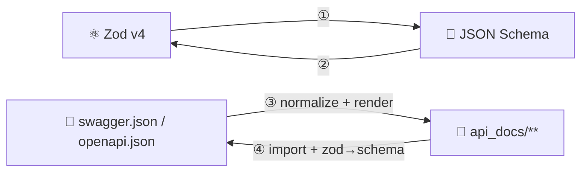

# 🔄 Conversion Engines

The four engines of zopia, pinned to exact rules. **These mapping tables are
the contract**: the implementation and the tests are written against them, and
any deviation is a bug (or a documented change to this file, in the same
commit).


```mermaid
flowchart LR
  Z["⚛️ Zod v4"] -->|①| JS["📐 JSON Schema"]
  JS -->|②| Z
  SPEC["📄 swagger.json / openapi.json"] -->|③ normalize + render| DOC["📂 api_docs/**"]
  DOC -->|④ import + zod→schema| SPEC
```

> 🧭 The conversion cores are pure (P-3): object inputs produce in-memory
> results. File access belongs to public wrappers (`openApiToApiDocs` /
> `apiDocsToOpenApi`); `jsonSchemaToZod()` additionally resolves its documented
> `.json` path convenience before invoking the same in-memory emitter.

### ⚠️ Shared warning contract

All four engines use `ZopiaWarning = { code, at?, message }`, where `code` is
one of the exported stable `ZOPIA_WARNING_CODES` and `at` is an escaped JSON
Pointer when the location is discoverable. Before an engine returns warnings
or invokes a callback, it sanitizes one-line messages, removes exact
duplicates, and sorts by pointer/code/message. Nested conversions rebase their
pointers into the containing OpenAPI location.

Engine ① reports through `onWarning`; engine ② returns `warnings` and mirrors
them in generated code; engines ③ and ④ return warnings on their result
objects. `ZopiaReverseOptions.onWarning` receives the same normalized warnings
returned by `apiDocsToOpenApi()`. The CLI prints canonical diagnostics to
stderr and never mixes them into reverse JSON on stdout.

---

## Engine ① — Zod → JSON Schema

```ts
/** ⚛️ Convert a Zod v4 schema to a JSON Schema object. */
function zodToJsonSchema(schema: $ZodType, options?: ZodToJsonSchemaOptions): JsonSchemaObject;
```

| ⚙️ Option | 📏 Type | 🆔 Default | 📝 Meaning |
| --- | --- | --- | --- |
| `target` | `'openapi-3.1' \| 'openapi-3.0' \| 'draft-2020-12' \| 'draft-07'` | `'openapi-3.1'` | dialect of the output |
| `$schema` | `boolean` | `true` | include the `$schema` URI — Zod emits it natively for the draft targets; for the `openapi-3.0` target (where Zod omits it) zopia adds `http://json-schema.org/draft-07/schema#` when enabled, removes it when disabled |
| `io` | `'input' \| 'output'` | `'output'` | Zod's native `io` param — `output` = what the schema produces; `input` = what the client sends. Engine ④ converts **request** schemas with `io: 'input'`, **response** schemas with `io: 'output'` (R-615) |
| `onWarning` | `(warning: ZopiaWarning) => void` | `undefined` | receives each structured, non-fatal conversion warning; engine wrappers use this collector to aggregate warnings into their own result |

**Implementation** (D-03): a thin, deterministic layer over Zod v4's built-in
`z.toJSONSchema()`. The `zod-to-json-schema` third-party package is **not used**
(deprecated since Nov 2025 — Zod v4 is self-sufficient).

| 🎯 zopia `target` | Zod `target` param | 📝 Notes |
| --- | --- | --- |
| `openapi-3.1` | `draft-2020-12` | OpenAPI 3.1 schema objects *are* 2020-12 |
| `openapi-3.0` | `openapi-3.0` | Zod's own 3.0-compatible target (`nullable`, …) |
| `draft-2020-12` | `draft-2020-12` | pure JSON Schema |
| `draft-07` | `draft-07` | legacy consumers (closest modern dialect for Swagger 2.0-era readers) |

**Fixed behaviours**

| # | Behaviour | Rule |
| --- | --- | --- |
| R-611 | 🌗 Nullability | `z.string().nullable()` → `type: ["string", "null"]` (2020-12/3.1) or `nullable: true` (3.0 target) — whatever the target dialect prescribes |
| R-612 | 📝 Metadata | `.describe("…")` → `description`; JSON-compatible `.meta({ … })` / `z.globalRegistry` entries → **all** metadata fields copied verbatim (`title`, `description`, `examples`, … — verified); the `id` metadata key is never emitted (it would trigger Zod's `$def` extraction). Non-JSON metadata is localized to `{}` with `ZOPIA_WARN_UNREPRESENTABLE` rather than silently normalized or dropped |
| R-613 | 🌀 Cycles | Zod's `cycles: "ref"` handling — recursive schemas become `$defs` + `$ref` |
| R-614 | 🚫 Unrepresentable | Every site reported by Zod's `unrepresentable` handler — including `z.bigint()`, `z.int64()`, `z.symbol()`, `z.undefined()`, `z.void()`, `z.date()`, `z.map()`, `z.set()`, `z.function()`, `z.transform()`, `z.nan()`, `z.custom()`, `z.number().multipleOf(0)`, unsupported literal/default values, symbol object keys, and dynamic catch values — becomes `{}` plus `ZOPIA_WARN_UNREPRESENTABLE` delivered to `onWarning` (never a throw, R-408; Zod's own default is to throw). zopia preflights defaults so non-finite numbers, symbols, functions, cycles, and other non-JSON values cannot be silently normalized or throw before the warning handler. Nested warnings carry an escaped JSON Pointer in `at`. ⚠️ `z.void()` is special-cased *before* conversion in engine ④ for 204-style no-content responses (R-654) |
| R-615 | 🔄 io semantics | default conversion represents the **output** type. zopia converts **request** schemas with `io: 'input'` (what the client sends — defaulted request fields stay *optional*, so source `required`/`default` round-trip exactly) and **response** schemas with the default `io: 'output'`. For transforms/pipes, `io` selects the side |
| R-616 | 🗺️ Records/maps | `z.record(k, v)` → `{"type":"object","additionalProperties": v}` plus `propertyNames` when `k` is a constrained schema (Zod's native shape); `z.map(k, v)` — and `z.set(v)` — are **unrepresentable** (R-614: `{}` + warning; Zod throws for both by default) |
| R-617 | 📏 Key order | canonical (R-401): a root `$schema` header first, then `type`; reference, validation, applicator, annotation, and unknown keywords follow a fixed dictionary (unknown keys sort lexically). Schema-property names and literal data retain source order. The ordering is recursive and byte-stable (zopia re-sorts Zod's emission order) |
| R-618 | 🧹 Redundancy stripping | Zod emits built-in format schemas with a strict companion `pattern`, and `z.number().int()` with sentinel bounds `minimum: -9007199254740991` / `maximum: 9007199254740991` (±(2⁵³−1)). ① **strips** (a) `pattern` when paired with a known built-in `format` (`uuid`, `email`, `hostname`, `ipv4`, `ipv6`, `date-time`, `date`, `duration`, `uri`), and (b) each sentinel bound whenever present (independently). Custom patterns (`z.string().regex(…)` — no `format`) and real user bounds are kept. This is what keeps ① output spec-clean and round-trips exact |

**Example**

```ts
const user = z.object({
  id: z.uuid(),
  name: z.string().min(1).describe('Display name'),
  email: z.email(),
  role: z.enum(['admin', 'editor', 'viewer']).default('viewer'),
});

zodToJsonSchema(user, { target: 'openapi-3.1' });
// ↓
{
  $schema: 'https://json-schema.org/draft/2020-12/schema',
  type: 'object',
  properties: {
    id: { type: 'string', format: 'uuid' },
    name: { type: 'string', minLength: 1, description: 'Display name' },
    email: { type: 'string', format: 'email' },
    role: { type: 'string', enum: ['admin', 'editor', 'viewer'], default: 'viewer' },
  },
  required: ['id', 'name', 'email', 'role'],
  additionalProperties: false,
}
// ⤴ output-side semantics: Zod puts defaulted keys in `required`
//   (role has a default but is always present in the output).
//   Request schemas are converted with io: 'input' instead (R-615):
zodToJsonSchema(user, { target: 'openapi-3.1', io: 'input' });
// → required: ['id', 'name', 'email']  (role stays optional, default kept)
```

---

## Engine ② — JSON Schema → Zod

```ts
/** 📐 Convert a JSON Schema object (or .json file path) to Zod v4 code. */
function jsonSchemaToZod(schema: JsonSchemaObject | string, options?: JsonSchemaToZodOptions): JsonSchemaToZodResult;

interface JsonSchemaToZodResult {
  /** 📝 TypeScript source — Zod v4 code, ready to paste into api_docs. */
  code: string;
  /** ⚙️ Runtime equivalent of `code` (built by the same emitter). */
  schema: $ZodType;
  /** ⚠️ Every lossy/unsupported conversion (R-408 / D-12). */
  warnings: ZopiaWarning[];
  /** 🩹 Manifest-compatible exact restorations for non-identity mappings. */
  overlays: JsonSchemaOverlay[];
}
```

**Implementation** (D-04): a custom recursive emitter. Zod's experimental
`z.fromJSONSchema()` is *not* the output path (experimental status) — it is
used in tests as an independent cross-check. A string input is parsed as JSON
text unless it ends in `.json`, in which case that path is read first; object
and boolean inputs stay entirely in memory. The runtime schema retains source
property order, while emitted TypeScript sorts definition, property, dependency,
pattern, extension, and literal-object keys lexically. This code-only
canonicalization makes generation byte-stable after manifests recursively sort
JSON object keys. During reverse conversion, source `required` order (including
an explicit empty array) is restored only when runtime membership is unchanged;
a developer edit that adds or removes required fields remains authoritative.
The runtime and emitted-code results have equivalent validation behavior.

### 🔁 The keyword map (the contract)

| 📐 JSON Schema | ⚛️ Zod v4 emitted | 🆔 Rule |
| --- | --- | --- |
| `{ "type": "string" }` | `z.string()` | R-621 |
| `{ "type": "integer" }` | `z.number().int()` | R-621 |
| `{ "type": "number" }` | `z.number()` | R-621 |
| `{ "type": "boolean" }` | `z.boolean()` | R-621 |
| `{ "type": "null" }` | `z.null()` | R-621 |
| `{ "type": "array", "items": S }` | `z.array(⟦S⟧)` | R-622 |
| `{ "type": "array", "items": [A, B] }` *(tuple, draft-04/07)* | `z.tuple([⟦A⟧.optional(), ⟦B⟧.optional()])`; `minItems` makes the corresponding leading positions required; overlay metadata restores the draft tuple spelling and `additionalItems` exactly | R-622/R-635 |
| `{ "type": "array", "prefixItems": [A, B] }` *(2020-12 tuple)* | `z.tuple([⟦A⟧.optional(), ⟦B⟧.optional()])`; `minItems` makes the corresponding leading positions required; absent `items` remains absent after reverse conversion | R-622/R-635 |
| `{ "type": "object", "properties": P, "required": R }` | `z.object({…})` — keys in `R` plain, others `.optional()` | R-623 |
| `{}` or annotations without `type` | `z.any()` | R-624 |
| object-, array-, string-, or numeric-only keywords without `type` | intersection of applicable-type unions: each constrained matching type plus unconstrained non-matching JSON types, preserving JSON Schema keyword applicability; frozen overlay restores the original keyword-only shape | R-624, R-635 |
| `{ "type": ["string", "null"] }` *(3.1/2020-12 nullable)* | `z.union([⟦string⟧, z.null()])`; frozen overlay restores the original type-array shape | R-625, R-635 |
| `{ "nullable": true }` *(3.0)* | `⟦…⟧.nullable()` around the complete converted schema, including a local reference and all of its validation siblings | R-625 |
| `{ "enum": ["a", "b"] }` | `z.enum(['a', 'b'])` (string enums — round-trips exactly) | R-626 |
| `{ "enum": [1, 2] }` / primitive mixed | `z.union([z.literal(1), z.literal(2)])` — ⚠️ ① expands this to `anyOf` of `const` nodes; engine ④'s serializer re-emits it as `enum` (R-654) | R-626 |
| structured/mixed `{ "enum": […] }` containing objects or arrays | one JSON-equality refinement with exact `enum` metadata, so runtime and generated code accept the same values and ① serializes the original enum shape | R-626 |
| `{ "const": v }` | primitives use `z.literal(v)`; arrays/objects use an exact JSON-equality refinement with `const` metadata | R-626 |
| `{ "format": "email" \| "uuid" \| "hostname" \| "ipv4" \| "ipv6" \| "date-time" \| "date" \| "duration" }` | `z.email()` / `z.uuid()` / `z.hostname()` / `z.ipv4()` / `z.ipv6()` / `z.iso.datetime()` / `z.iso.date()` / `z.iso.duration()` — all round-trip exactly (① strips Zod's companion `pattern`, R-618) | R-627 |
| `{ "format": "uri" \| "url" }` | `z.url()` — Zod emits `format: "uri"`; when the source said `"url"` an overlay entry restores the exact original alias (R-635) | R-627 |
| `{ "format": "time" }` | `z.iso.time()` — ⚠️ Zod emits a pattern but **no** `format` key; overlay entry restores `{ "format": "time" }` and removes the pattern (R-635) | R-627 |
| `{ "format": "byte" }` *(Swagger 2.0 — base64)* | `z.base64()` — Zod emits `format: "base64"` + `contentEncoding` + pattern; overlay restores `format: "byte"` and removes the extras (R-635) | R-627 |
| `{ "format": "base64" \| "base64url" \| "emoji" }` | corresponding native Zod string check + warning/overlay because ①'s serialized keyword set differs from the source alias | R-627, R-635 |
| `{ "format": "int32" \| "int64" \| "uint32" \| "uint64" }` on a numeric schema | integer check plus the representable signed/unsigned bounds; warning/overlay restores the format and original user bounds. `int64` additionally uses `ZOPIA_WARN_INT64` because JavaScript has no exact 64-bit integer domain | R-627, R-635 |
| `{ "format": "<other>" }` on **any** base type | any format without an explicit row above (`password`, `binary`, `float`, `double`, `uri-reference`, `regex`, `decimal`, `json-pointer`, …) → the **base type without the format** + warning `ZOPIA_WARN_CUSTOM_FORMAT` + overlay restoring the format verbatim | R-627, R-635 |
| `{ "minimum": n }` / `{ "maximum": n }` | `.min(n)` / `.max(n)` | R-628 |
| `{ "exclusiveMinimum": n }` *(number — 2020-12/3.1)* | `.gt(n)` — round-trips exactly (Zod emits numeric `exclusiveMinimum`) | R-628 |
| `{ "exclusiveMinimum": true }` *(boolean — draft-04/07)* | `.gt(n)` over `minimum` for numbers; `.min(n + 1)` for integers — **plus warning** `ZOPIA_WARN_LEGACY_EXCLUSIVE_BOUND` + overlay restoring the original boolean form (R-635) | R-628 |
| `{ "minimum": n, "exclusiveMinimum": m }` / `{ "maximum": n, "exclusiveMaximum": m }` *(both bounds, numeric)* | both checks are emitted (`.min(n).gt(m)`), but `z.toJSONSchema()` keeps only the tighter keyword — so the authored **pair** is recorded in an overlay `set` and restored verbatim on reverse. Nothing is normalized silently (D-12) | R-628, R-635 |
| `{ "minLength": n }` / `{ "maxLength": n }` | `.min(n)` / `.max(n)` on strings | R-628 |
| `{ "pattern": p }` | `.regex(new RegExp(p))` | R-628 |
| `{ "contentEncoding": "base64" \| "base64url" \| "hex" }` | corresponding native/pattern string check; overlay restores the exact encoding keyword. Other encodings and `contentMediaType` retain base validation, warn, and are preserved by overlays | R-634, R-635 |
| `{ "multipleOf": n }` | `.multipleOf(n)` | R-628 |
| `{ "minItems": n }` / `{ "maxItems": n }` | homogeneous array `.min(n)` / `.max(n)`; tuple length refinements (with leading tuple positions required by `minItems`) | R-628 |
| `{ "uniqueItems": true }` | exact JSON-value equality refinement + **warning** `ZOPIA_WARN_UNIQUE_ITEMS` + overlay `set: { "uniqueItems": true }` (Zod cannot serialize the refinement keyword, so reverse restores it verbatim); cyclic, coercible, BigInt, and other non-JSON runtime candidates fail validation rather than throwing | D-12 |
| `{ "default": v }` | `⟦…⟧.default(v)` around the complete schema (including local references). Defaults, enum/const values, and annotation/extension payloads must be JSON values; invalid programmatic values are ignored with `ZOPIA_WARN_INVALID_SCHEMA` so runtime/code behavior cannot diverge | R-629 |
| `{ "required": [...] }` | keys listed are non-optional | R-623 |
| `{ "additionalProperties": false }` | `z.object({…}).strict()` | R-630 |
| `{ "additionalProperties": S }` | `z.object({…}).catchall(⟦S⟧)` | R-630 |
| `{ "additionalProperties": true }` *(or absent)* | `z.object({…}).passthrough()` | R-630 |
| `{ "dependencies": { "a": ["b"] } }` *(draft-04/06/07)* | object refinement requiring `b` whenever `a` is present | R-630 |
| `{ "dependencies": { "a": S } }` *(draft-04/06/07)* | object refinement applying schema `S` whenever `a` is present; boolean schemas are supported | R-630 |
| `{ "oneOf": [A, B, …] }` | `z.union([⟦A⟧, ⟦B⟧, …])` | R-631 |
| `{ "oneOf": […], "discriminator": {"propertyName": k} }` | `z.discriminatedUnion(k, [⟦…⟧])` — every member must be an object with a literal/enum at `k`, otherwise fall back to `z.union` + warning; the `discriminator` keyword itself is restored by an overlay entry (R-635) | R-631 |
| `{ "anyOf": […] }` | `z.union([…])` | R-631 |
| `{ "allOf": [A, B, …] }` | `z.intersection(⟦A⟧, ⟦B⟧, …)` (left-fold) — ⚠️ ① flattens object intersections into one object (structural loss) → overlay `node` entry freezes the original `allOf` subtree verbatim (R-635/R-659) | R-632 |
| Boolean schema / empty object | `true` and `{}` → `z.any()` · `false` → `z.never()`; boolean syntax is recorded as a no-warning overlay because Zod serializes these as `{}` / `{ "not": {} }`, while exact `{ "not": {} }` maps natively back to `z.never()` | R-632/R-635 |
| Keyword-only / type-array schema | union that constrains only applicable JSON instance types + warning `ZOPIA_WARN_FROZEN_SUBTREE` + overlay `node` (restores the original applicability structure exactly) | R-633, D-12 |
| `{ "not": S }` | refinement rejecting values accepted by `S` + warning `ZOPIA_WARN_NOT` + overlay `node` (Zod cannot serialize `not`, so the original subtree is restored verbatim) | D-12 |
| `{ "$schema": … } / { "$id": … } / { "$comment": … }` | no Zod runtime effect; preserved verbatim by an overlay `set` entry | R-636 |
| `{ "title": t }` / `{ "description": d }` / `{ "example": v }` / `{ "examples": […] }` | a single `.meta({ title?, description?, examples? })` call on the schema (only the fields present) — verified copied verbatim back by ① (R-612), plus a JSDoc comment for human readers. `example` (single) is normalized to `examples: [v]` | R-633 |
| `{ "readOnly": … }` / `{ "writeOnly": … }` / `{ "deprecated": … }` / XML, discriminator, external-doc, and `x-…` annotations | copied into `.meta(…)` and retained by Engine ①, including when they are siblings of a local reference | R-633 |
| `{ "$ref": "#/…/schemas/X" }` | engine ② resolves local definitions (including percent-encoded URI-fragment segments) through its `$defs` closure and intersects sibling constraints; engine ③ default mode embeds needed component definitions, reference mode imports direct `XSchema` targets, and nested component pointers are embedded rather than misclassified as component names | R-402/R-403/R-634 |
| `{ "$defs": { … } }` / `{ "definitions": { … } }` | file-local consts, in definition order; malformed containers and entries emit exact-pointer `ZOPIA_WARN_INVALID_SCHEMA` warnings instead of disappearing | R-634 |
| `{ "if": I, "then": T, "else": E }` | base schema plus a refinement that validates `T` when `I` succeeds and `E` otherwise; boolean branches and exact keyword-only applicability are supported, while malformed/detached branches warn | R-632 |
| `{ "propertyNames": { "type": "string", <pattern/minLength/maxLength> }, "additionalProperties": <schema> }` with no other object-structure keywords | `z.record(⟦propertyNames⟧, ⟦additionalProperties⟧)` — an exact conversion: Zod emits the identical `{ type: 'object', propertyNames, additionalProperties }` shape back, so this form produces **no** warning and **no** overlay | D-22 |
| `{ "patternProperties": … }` / non-native `{ "propertyNames": … }` forms / `{ "minProperties": n }` / `{ "maxProperties": n }` / `{ "contains": … }` | runtime refinements apply each matching pattern/property/count/containment constraint; `additionalProperties` applies only to keys unmatched by declared properties and patterns; warning + overlay `node` restores the original unsupported structure | D-12 |

> ⟦S⟧ = "the Zod code of the sub-schema S" (recursion).

> 📌 **Rule R-635** — *overlay recording.* Every ② mapping that is not
> round-trip-identity records a **manifest overlay entry** preserving the
> original keywords verbatim, so engine ④ can restore them. Overlay entry:
> `{ at: <JSON pointer>, set?: <keywords>, remove?: <keys>, node?: <sub-tree> }` —
> `set`/`remove` for surgical keyword restoration (format aliases, `time`,
> false/legacy exclusive bounds, absent tuple/object keys, empty `required`,
> local definitions, `discriminator`, `uniqueItems`), `node` for exact boolean
> schema syntax and structural freezes (`allOf`-of-objects, `not`, `if/then/else`,
> `patternProperties`, … — each emits warning `ZOPIA_WARN_FROZEN_SUBTREE`).
> A schema with no lossy keywords produces **no** overlay entries — the
> canonical Admin API fixture asserts exactly that. Standalone callers receive
> these entries in `JsonSchemaToZodResult.overlays`; engine ③ prefixes each
> pointer with the operation/component location and writes the entries to the
> manifest. Engine ④ applies them after runtime Zod serialization.

### 📏 Emitted code style (fixed)

| 📏 Rule | Example |
| --- | --- |
| deterministic TypeScript/JSON literals, semicolon-terminated declarations, one trailing newline | `const schema = z.literal("ready");` |
| chainable checks stay in one expression; warning-marker wrappers use stable multiline indentation | `z.string().min(1).max(100).regex(new RegExp("x"))` |
| component consts are `PascalCase + 'Schema'`; local `$defs` names are sanitized lower-camel identifiers | `UserSchema`, `node` |
| schema reuse is identity-driven (R-403) | default endpoints inline each occurrence; component-reference endpoints reuse one import |
| circular refs → `z.lazy(() => XSchema)` (R-402) | — |
| warnings mirrored inside the containing emitted expression as `// @zopia:warn <CODE> <keyword> — <message> (<JSON pointer>)`; the pointer identifies the exact source node | — |

**Example**

```ts
jsonSchemaToZod({
  type: 'object',
  required: ['name', 'email'],
  properties: {
    name:  { type: 'string', minLength: 1 },
    email: { type: 'string', format: 'email' },
    role:  { type: 'string', enum: ['admin', 'editor', 'viewer'], default: 'viewer' },
    id:    { type: 'string', format: 'uuid' },
  },
});
// ↓ code  (rootName default: 'schema' — see Configuration)
`
const schema = z.object({
  name: z.string().min(1),
  email: z.email(),
  role: z.enum(['admin', 'editor', 'viewer']).default('viewer'),
  id: z.uuid().optional(),
});
`
```

---

## Engine ③ — OpenAPI → api docs

```ts
/** 📄 Generate the api_docs tree from a spec (object, JSON/YAML text, or .json/.yaml/.yml file path). */
function openApiToApiDocs(input: string | Record<string, unknown>, options?: ZopiaGenerateOptions): Promise<ZopiaGenerateResult>;
```

Pipeline (see [Architecture → The pipeline](04-architecture.md#-the-pipeline)):
**detect → bundle external refs (file inputs, D-17) → normalize (v2 | v3) → refs → render (directory | flat) → manifest**.

**Input parsing (v0.2.x, D-16):** text starting with `{`/`[` is parsed as
JSON; otherwise an unreadable-path-looking string is read as a file, and the
extension picks the parser (`.json` → JSON, `.yaml`/`.yml` → YAML, anything
else → JSON with YAML fallback). Multi-line non-JSON text and single-line
mapping entries (`swagger: "2.0"`, …) are parsed as inline YAML. YAML is a
deterministic, owned YAML 1.2 core-schema parser (`src/conversions/yaml.ts`):
block/flow collections (comments, blank lines, and dedented closers inside
multi-line flow; optional trailing commas), plain/single/double-quoted scalars,
literal/folded block scalars (`#` lines indented as deeply as the content are
literal content; shallower ones are ignorable comments), comments,
anchors/aliases (resolutions clone the anchored value), `<<` merge keys,
`%YAML 1.x` directives, and single-document `---`/`...` markers are
supported; tab indentation, duplicate keys, undefined aliases, custom tags,
multiple documents, complex `?` keys, content after the `...` marker,
block-scalar header junk, structure-looking plain continuations (`k: word`
followed by a deeper `a: b`/`- x` line), bare `key: value` pairs inside
flow sequences, and `.inf`/`.nan` are rejected. Parsed YAML produces the same plain values as
an equivalent JSON document, so every downstream rule in this document is
identical for both input formats.

**External `$ref` bundling (v0.2.x, D-17):** inputs that resolve to a *file
path* bundle same-folder external references before normalization — `other.yaml`
(with `.json`/`.yml` variants, `./…` spellings, an optional `#` JSON Pointer,
and whole-file targets without a fragment). Every sibling file is read and
parsed once (JSON/YAML by extension, same rules as the primary input), bundled
content is deep-cloned into place, sibling keys next to a `$ref` win over the
bundled content, a local ref inside bundled content keeps resolving against its
own file, and host-document local refs (`#/…`) stay untouched. Traversal skips
literal/example payload positions exactly like the reference preflight walker.
References outside the spec folder (URLs, `../`, absolute paths, subdirectories,
drives, non-spec extensions) — and *any* external ref in object or text inputs —
keep failing with `ZOPIA_REF_EXTERNAL`; unreadable targets keep that code with
the file as `cause`; unparsable targets fail with
`ZOPIA_SPEC_INVALID_JSON`/`ZOPIA_SPEC_INVALID_YAML` at the target path; missing
pointers, bad fragments, circular external chains, sibling keys on non-object
targets, and chains deeper than 512 fail with `ZOPIA_REF_NOT_FOUND`. Because
bundling runs before the manifest's source hash, the bundled spec, an
equivalent inline spec, and everything derived from them (generated trees,
warnings, reverse conversion output) are byte-identical; reverse conversion
emits the bundled single-file document and never re-splits files.

### 🔍 Step 1 — detect

| 🧾 Top-level | 🏷️ Kind |
| --- | --- |
| `swagger === '2.0'` | `openapi-2.0` |
| `openapi === '3.0.x'` | `openapi-3.0` |
| `openapi === '3.1.x'` | `openapi-3.1` |
| anything else | 🛑 `ZOPIA_SPEC_UNSUPPORTED_VERSION` |

Missing `paths` → `ZOPIA_SPEC_MISSING_PATHS`. Invalid JSON → `ZOPIA_SPEC_INVALID_JSON`; invalid YAML → `ZOPIA_SPEC_INVALID_YAML`. `swagger` and `openapi` are mutually exclusive, and root keys must belong to the selected dialect or be `x-…` extensions. Path Item keys must be supported lowercase HTTP methods, dialect-appropriate fixed fields, or `x-…` extensions; typos and unsupported fields fail instead of disappearing from the generated tree.

### 🔧 Step 2 — normalize (the dialect tables)

#### Swagger 2.0 → IR

| 📐 Swagger 2.0 | 🧬 IR |
| --- | --- |
| `definitions` | `components` (R-503: 2020-12-flavoured) |
| `host` + `schemes[0]` + `basePath` | `servers: [ "<scheme>://<host><basePath>" ]` (or `[basePath]` / `['/']` without host) |
| parameter `in: body` | `request.body` = its `schema`; `requestContentType` from operation `consumes` (else global). Multiple body parameters and OpenAPI 3-style operation `requestBody` are rejected |
| parameters `in: formData` | `request.body` = object of the formData params (`required` flags kept); valid primitive/array values plus top-level `type: file` are supported, while `type: object` and arrays with illegal or incomplete nested Items Objects are rejected; `requestContentType` = `multipart/form-data` if in `consumes`, else `application/x-www-form-urlencoded` |
| parameters `in: query/header/path` | `request.query/headers/params` — Swagger primitive/array params (`type`, `format`, `enum`, …) become their `schema`; every nested array Items Object must declare a legal primitive/array type. OpenAPI 3-style `schema`/`content`, plus `object` and `file` outside their legal body/form locations, are rejected; `type: integer, format: int32/int64` → `{ "type": "integer" }` (`int64` → + warning `ZOPIA_WARN_INT64`) |
| operation/global `consumes` | must be an array of non-empty strings; `requestContentType` uses the first JSON-ish type (else first) |
| operation/global `produces` | must be an array of non-empty strings; `responseContentType` uses the first JSON-ish type (else first), and each response's single `schema` → `response.statuses[].schema` under that media type. OpenAPI 3-style response `content` and response-level `produces` are rejected. Swagger response keys are exact `100`–`599` statuses or `default` (OpenAPI `4XX`-style ranges are rejected) |
| response `examples` (media-type → single value, the legacy shape) | wrapped as one `default`-named example under the primary media type |
| `securityDefinitions` (basic/apiKey/oauth2) | `securitySchemes` (OpenAPI 3 shapes) |
| `security` (op or global) | op-level `security` / global `defaultSecurity` (verbatim requirement lists) + `auth: 'YES'` where a requirement applies (explicit `security: []` ⇒ `auth: 'NO'`) |
| `deprecated: true` | `deprecated: true` |
| `basePath` / version | manifest `source` + `servers` |

#### OpenAPI 3.0/3.1 → IR

| 📐 OpenAPI 3.x | 🧬 IR |
| --- | --- |
| `components.schemas` | `components` |
| `servers[]` | full entries preserved in the manifest; `variables` emit `ZOPIA_WARN_SERVER_VARIABLES` because endpoint modules have no representation |
| `requestBody.content` | primary media type (R-641) → `request.body` + `requestContentType`; others recorded in manifest |
| parameters `in: path/query/header/cookie` | `request.params/query/headers/cookies`; every `{name}` path placeholder requires exactly one matching required path parameter and unrelated path parameters are rejected; OpenAPI 3 rejects legacy `in: body/formData` parameters and top-level Swagger schema keywords (`schema`/`content` must be used), while `cookie` is accepted only for OpenAPI 3.x because Swagger 2.0 has no cookie parameter location |
| `responses` (per media type) | `response.statuses[]` — primary media type per response (R-641); description required by spec → kept; legacy top-level response `schema` is rejected in favor of `content` |
| `nullable: true` *(3.0)* | `type: [t, "null"]` in the IR (R-503) |
| `exclusiveMinimum/Maximum` boolean *(3.0)* | numeric form + warning (R-628) |
| `components.securitySchemes` | `securitySchemes` |
| `security` (op or global) | op-level `security` / global `defaultSecurity` (verbatim requirement lists) + `auth: 'YES'` where a requirement applies (explicit `security: []` ⇒ `auth: 'NO'`) |
| `example` (single) | `examples` single-name map |
| the `default` response & non-standard codes (`419`, `499`, `512`, …) | emitted verbatim as the `default` / numeric response keys (km-api ≥ 0.4.1 accepts both) |
| parameter extras (`allowEmptyValue`, `style`, `explode`, `deprecated`, `example`) | no home in Zod/km-api → overlay entries on the operation subtree pointers (R-635) |
| response `headers` | no home in km-api → `apis[].responseOverlay` entries (re-emitted verbatim, R-654c) |
| 3.1 `webhooks` object | webhook operations emit endpoint files under `webhooks/<name>/<method>/index.ts` (D-23) with the same component/`$ref` handling as path endpoints; operation-less webhook maps stay manifest-only with `ZOPIA_WARN_WEBHOOKS` |
| path item that is a local `$ref` | resolve the local JSON Pointer (including chained references); external, missing, malformed, and circular references are rejected |
| `deprecated: true` | `deprecated: true` |

> 📌 **Rule R-641** — *primary media type*: when a `content` map has several
> entries, `application/json` wins; otherwise the first key in document order.
> Non-primary media types are recorded in the manifest and produce warning
> `ZOPIA_WARN_MULTI_CONTENT`.
>
> 📌 **Rule R-642** — *the km-api 0.4.1 contract.* zopia **requires km-api ≥
> 0.4.1**: `makeApiConfig` is a type-level factory (no runtime validation), so
> the generated tree must **typecheck** against installed published km-api
> 0.4.1 (D-14; the golden-tree contract test enforces this, R-126). All 8
> methods (including `trace`), custom numeric and `default` response statuses,
> arbitrary OpenAPI MIME keys, and `operationId` are emitted as code. Because
> km-api 0.4.1's published declarations enumerate MIME values even though
> OpenAPI allows extension strings, zopia keeps the exact runtime string behind
> a narrow type-only assertion at that package boundary; the strict generated
> call still checks the rest of `makeApiConfig`. The remaining km-api gaps
> (per-parameter metadata, response `headers`) are preserved in the manifest
> (overlay / `apis[].responseOverlay`, R-635/R-754).

### 🔗 Step 3 — refs

Per [Architecture → The reference graph](04-architecture.md#-the-reference-graph)
(R-402): file-path inputs first bundle *same-folder* external refs inline
(D-17, above); afterwards unknown → `ZOPIA_REF_NOT_FOUND`; remaining external
→ `ZOPIA_REF_EXTERNAL`; cycles → `z.lazy` plan. Refs to **non-schema** reusable objects (global
`parameters`/`responses` in 2.0, `components.parameters/responses/examples`
in 3.x) stay out of the schema graph. In components mode, bare-namespace `$ref`
use sites import the declaration's module (`components/parameters/<Name>`,
`components/responses/<Name>` — D-18); merged `$ref`-sibling forms resolve at
use sites for endpoint rendering as before. Every declaration and exact ref
placement remains in the manifest and is restored by engine ④, with reusable
parameter/response declarations refreshed from their current modules
(R-402/R-655/R-659).

### 🖨️ Step 4 — render

Lays out files per the mode and emits code:

- 📂 layout — [API docs format](07-api-docs.md) (trees, naming, collisions)
- 📄 endpoint files — the **`index.ts` contract** ([07 → contract](07-api-docs.md#-the-indexts-contract)); every *practical* field of `makeApiConfig` is filled from the IR when the source provides it (T-7)
- 🧱 components — [Components](08-components.md)
- 📦 manifest — [07 → The manifest](07-api-docs.md)

**Result**

```ts
interface ZopiaGenerateResult {
  /** 📂 Every file written, relative to outDir, sorted (R-401). */
  files: Array<{ path: string; kind: 'endpoint' | 'component' | 'manifest' }>;
  /** ⚠️ All warnings (R-408). */
  warnings: ZopiaWarning[];
  /** 📦 Manifest path relative to outDir; absent when `manifest: false`. */
  manifestPath?: string;
}
```

The public wrapper validates all options before filesystem access, reads file
inputs, rejects missing/external references with stable `ZopiaError` codes,
preflights every operation contract, and returns paths sorted independently of
source document order. Before regeneration it compares the existing manifest's
canonical source hash, layout, component options, and owned-file presence.
Any drift (or an invalid manifest) emits one `ZOPIA_WARN_STALE_TREE`; after new
files are written, obsolete files claimed by the previous valid manifest are
pruned without touching custom files. Symlinked ancestors are rejected with
`ZOPIA_FS_OUTSIDE_OUTDIR`. `manifest: false` removes a previous manifest and
omits both the new manifest file and `manifestPath`.

---

## Engine ④ — api docs → OpenAPI

```ts
/** 📦 Documented directory-level API; defaults to OpenAPI 3.1. */
function apiDocsToOpenApi(path: string, options?: ZopiaReverseOptions): Promise<{ openapi: Record<string, unknown>; warnings: ZopiaWarning[] }>;

/** 📦 Low-level snapshot helper; omission preserves the manifest source dialect. */
function manifestToOpenApi(manifest: ZopiaManifest, options?: ZopiaReverseOptions): Record<string, unknown>;
function manifestFileToOpenApi(file: string, options?: ZopiaReverseOptions): Promise<Record<string, unknown>>;

interface ZopiaReverseOptions {
  version?: '2.0' | '3.0' | '3.1';
  onWarning?: (warning: ZopiaWarning) => void;
}

interface ZopiaManifest {
  $schema: 'zopia:manifest@1';
  source: { kind: string; title?: string; version?: string };
  pathOrder?: string[];
  schemaComponentsPresent?: boolean;
  components?: Array<{ name: string; file: string | null; schema: unknown }>;
  apis: Array<{ file: string; path: string; method: string; sourceOperation?: Record<string, unknown>; refs?: Array<{ at: string; ref?: string; component?: string }>; overlay?: Array<{ at?: string; set?: Record<string, unknown>; remove?: string[]; node?: unknown; key?: string; value?: unknown }>; responseOverlay?: unknown }>;
}
```

`manifestFileToOpenApi()` imports each trusted `apis[].file`, each `webhooks[].file`, and every emitted `components[].file` relative to the manifest. Runtime km-api metadata and edited request/response Zod schemas override their manifest snapshots; request-side schemas use Engine ① input semantics, response-side schemas use output semantics, and imported component references remain `$ref`s. A manifest `$ref` never replaces a different component selected in the runtime schema. Passing `version: '3.0' | '3.1'` selects both the document envelope and Engine ① schema target; Swagger source operations and reusable objects are normalized to the selected OpenAPI 3 dialect. Passing `version: '2.0'` (D-20) downgrades 3.x-sourced manifests through the source-dialect Swagger reconstruction path: `nullable` spellings become `x-nullable`, `requestBody` becomes `body`/`formData` parameters, `components.schemas` becomes `definitions`, reusable parameters/responses move to the top-level `parameters`/`responses` maps, `servers[0]` decomposes into `host`/`basePath`/`schemes`, and unrepresentable 3.x features drop with deterministic `ZOPIA_WARN_DIALECT_DOWNGRADE`/`ZOPIA_WARN_WEBHOOKS` warnings. `apiDocsToOpenApi()` supplies the documented 3.1 default, while the low-level manifest helpers preserve the source dialect when options are omitted for snapshot/backward compatibility. `manifestToOpenApi()` remains synchronous and never imports files.

| # | Step | Rules |
| --- | --- | --- |
| R-651 | 📦 **Manifest required** | no `.zopia-manifest.json` → `ZOPIA_DOCS_MISSING_MANIFEST`; a missing file field or a missing/renamed endpoint or emitted-component file → `ZOPIA_DOCS_MANIFEST_MISMATCH`. All listed paths are preflighted (including containment and regular-file checks) before any generated module is imported, so a stale manifest cannot partially execute the tree. (The manifest is what makes flat mode unambiguous — D-06.) |
| R-660 | 🧵 **Swagger serialization → 3.x** | reversing a Swagger 2.0 manifest to `'3.0'`/`'3.1'` restores the wire format instead of falling back to 3.x defaults. `collectionFormat` on a `query` parameter becomes `csv` → `style: "form", explode: false`, `multi` → `style: "form", explode: true`, `pipes` → `style: "pipeDelimited"`, `ssv` → `style: "spaceDelimited"`; on `path`/`header` only `csv` maps (→ `style: "simple", explode: false`). `formData` array serialization moves to the media type's `encoding` map (`csv` → `form` + `explode: false`, `multi` → `form` + `explode: true`), and `type: "file"` becomes `{ "type": "string", "format": "binary" }`. Values with no legal 3.x spelling — `tsv` anywhere, and `pipes`/`ssv`/`tsv` in `encoding` objects or on `path`/`header` — keep the original in an `x-collectionFormat` extension and emit `ZOPIA_WARN_COLLECTION_FORMAT` at the output pointer (D-12). Shared `#/parameters/<Name>` declarations take the same mapping on their way to `components.parameters`. Reversing to `'2.0'` still restores `collectionFormat` and `type: "file"` verbatim. |
| R-661 | 🗂️ **Preset split roots** | `apiDocsToOpenApi()` / `zopia reverse` on a directory whose manifests live one level down (a `--preset` split: one tree per bucket, no manifest at the root — D-25) fails with `ZOPIA_DOCS_PRESET_ROOT` naming the actual bucket directories in alphabetical order and the single-bucket command to run, instead of the misleading `ZOPIA_DOCS_MISSING_MANIFEST`. A directory with no bucket manifest anywhere keeps `ZOPIA_DOCS_MISSING_MANIFEST`. Reverse converts exactly one tree; the runtime `createApiDocs()` merge is the supported way to consume every bucket at once. |
| R-652 | 🧬 **Trusted import** (D-08) | each `apis[].file` is imported at runtime (Bun executes the `.ts`). The module must export a `makeApiConfig` result — default or named; otherwise `ZOPIA_DOCS_IMPORT_FAILED`. |
| R-653 | 🧩 **Extraction** | from the config result: `method`, `pathShape → makeOpenApiPathShape()` (guarantees `{param}` form; identity on already-OpenAPI paths), `summary`, `description`, `operationId`, `tags` (strip `#`), `auth` (`'YES' | 'NO'`), `deprecated === 'YES'` → `deprecated: true`; `disable` remains an independent status field, `requestContentType`/`responseContentType` (the actual media types — km-api 0.4.1's open unions), `examples`. Edited media types replace the former selected media entry rather than retaining its stale manifest schema; runtime examples likewise replace `example`/`examples` snapshots. The operation's **`security` requirement** comes from the manifest, not the config (km-api stores only the `auth` status): `apis[].security` when present, else the top-level `defaultSecurity` — see R-656. Malformed edited path templates, missing or unrelated runtime path parameters, duplicate reconstructed operation IDs, and edited path/method collisions fail as generated-module errors instead of producing an invalid OpenAPI document; synchronous manifest-only reconstruction validates path parameters, request bodies, and response status/description/dialect contracts as `ZOPIA_MANIFEST_INVALID`. Response keys — including valid custom codes and `default` — come straight from the config after dialect-aware validation (`1XX`–`5XX` ranges are OpenAPI-only); response `headers` arrive via `apis[].responseOverlay`. |
| R-654 | 📐 **Schemas** | every request/response Zod schema → engine ① with `target: version === '3.0' ? 'openapi-3.0' : 'openapi-3.1'`; **request** schemas with `io: 'input'`, **response** schemas with `io: 'output'` (R-615) — so defaulted request fields naturally stay out of `required`. Engine ① losses are collected and rebased to the exact output operation/component pointer. Source-only structural details—boolean schema spelling, `required` order/presence, empty `properties`, unused local definitions, and the distinction between absent/`true` object openness—are restored only when the corresponding runtime structure is still equivalent; edited boolean children, required membership, strictness/passthrough, properties, and definitions remain authoritative. `z.any()` body → no `requestBody` unless the source body itself was unconstrained or schema-less (the manifest disambiguates those reversible cases). `z.void()` responses are detected **before** engine ① (Zod lists `z.void()` as unrepresentable — it would become `{}` + warning) → no `content` (e.g. 204). Empty `z.object({})` in params/query/headers/cookies → omitted. Swagger form-data is changed to a body parameter when code changes the request media type away from a form media type; cookie parameters and non-body object/reference schemas fail explicitly because Swagger 2.0 cannot represent them. The serializer then applies **value normalizations**: (a) drop sentinel safe-integer bounds (R-618), (b) re-emit const-literal `anyOf`/`oneOf` as `enum` (inverse of Zod's expansion), (c) `apis[].responseOverlay` entries (response `headers`) are re-emitted verbatim into the matching `responses` entry. |
| R-655 | 🧱 **Components** | the manifest **always** lists schema components (name, full `schema`, `file: <path> \| null`), and — in components mode — reusable parameter/response modules as `kind: "parameter"` / `"response"` entries with their derived schema (v0.2.x, D-18; schema-less responses get no entry), and uses `schemaComponentsPresent` to distinguish an absent container from explicit empty `definitions` / `components.schemas`; other OpenAPI component sections remain in `componentsOverlay`, while Swagger reusable `parameters` and `responses` are retained separately. `file` set (components mode): the component file is imported and converted — developer edits win where runtime Zod can express them, followed by exact syntax overlays. `file: null` (default mode): the manifest `schema` is re-emitted verbatim. File-based endpoint use-sites become `$ref`s from imported Zod identities; snapshot ref pointers never overwrite a developer-selected component (R-752). |
| R-656 | 🔐 **Security** | `securitySchemes` **and the requirement lists** (top-level `defaultSecurity`, per-operation `apis[].security`) are restored from the manifest and validated structurally. Manifest facts are authoritative even when an edited runtime `auth` flag conflicts: an operation emits its own `security` key iff `apis[].security` is present (an explicit `[]` is re-emitted as `security: []`), otherwise the global `security` is re-emitted from `defaultSecurity` (including `defaultSecurity: []`); readers also recover an explicit requirement from a legacy `sourceOperation` when its dedicated field is absent. Only when `auth: YES` has no recoverable requirement does reverse conversion synthesize a bearer requirement and report `ZOPIA_WARN_DEFAULT_SECURITY` at that operation's `/security` pointer. The fallback scans `bearerAuth`, `bearerAuth2`, and so on, reusing the first compatible definition or selecting the first free name without replacing existing definitions; OpenAPI 3 uses `http`/`bearer`, while source-dialect Swagger output uses its representable `apiKey`/`Authorization` header form. |
| R-657 | 🏷️ **Document frame** | `info` from the manifest `source` (title/version/description); the exact `openapi` patch string from `source.openapiVersion`; `servers`, `tags`, component/security-section presence, and path-item metadata/extensions from the manifest. `pathOrder` retains operation-free/empty Path Items and keeps reverse regeneration collision-stable. Absent and explicitly empty frame collections remain distinct. Legacy manifests missing title/version use `title: 'Zopia API'` / `version: '0.0.0'` and emit `ZOPIA_WARN_DEFAULT_INFO` at `#/info/title` / `#/info/version`. Newly generated manifests still require both values. |
| R-658 | 📏 **Shape** | `version: '3.0'` emits `openapi: '3.0.0'` with OpenAPI 3.0 schemas; `version: '3.1'` emits `openapi: '3.1.0'` with JSON Schema 2020-12 semantics. The directory-level API and CLI default to 3.1 (D-09); invalid versions fail with `ZOPIA_CONFIG_INVALID` before generated code is imported. Translation preserves nullable refs, literal annotation data, effective exclusive bounds, and every Swagger `consumes`/`produces` media type. A 3.1→3.0 conversion omits `webhooks`, `jsonSchemaDialect`, and `components.pathItems` only with source-located `ZOPIA_WARN_WEBHOOKS` / `ZOPIA_WARN_DIALECT_DOWNGRADE` diagnostics, and 2.0 output applies the same omissions plus the Swagger rewriting set (D-21). A path-item `$ref` whose target lives in an omitted container (`#/components/pathItems/…` or `#/webhooks/…`) expands its operation in place so the output never carries a dangling reference; references into surviving containers stay verbatim. |
| R-659 | 🩹 **Refs & overlays applied last** | after Zod serialization, file-backed conversion restores each `apis[].refs` entry at its RFC 6901 pointer, then applies schema overlays (`set`/`remove` or frozen `node`), operation overlays, and `responseOverlay`. A source ref is not restored when runtime code already points at a different component, and overlays beneath that skipped ref are skipped too; developer-selected reference changes therefore win. Draft-tuple overlays compare tuple members first, and reference-free frozen overlays compare the runtime subtree with a deterministic source baseline; an edited subtree skips the source overlay instead of losing the edit. Response overlays restore non-schema response facts without replacing code-derived `content`, Swagger `schema`, or examples. |

### 🔁 Why the round-trip closes

Two sources of truth, one rule each:

| 📦 Source | Carries |
| --- | --- |
| 📄 **the generated code** | schema *content* — what developers may edit. Converted back by engine ① + serializer normalizations (R-654) |
| 📦 **the manifest** | *placement & non-representable facts* — full component schemas, `$ref` pointers (`refs`), path-item metadata/ref inheritance (`pathsOverlay` / `pathItemRef`), keyword-level restorations (`overlay`: format aliases, `time`, boolean schemas/bounds, tuple spelling, `discriminator`, `uniqueItems`, parameter extras, …) plus conditional source-structure restoration for local definitions, empty/absent schema keys, and object openness and frozen subtrees (`overlay.node`: `allOf`-of-objects, `not`, `if/then/else`, `patternProperties`, …), km-api-less response facts (`apis[].responseOverlay`: response `headers` — R-754), plus the exact document frame and presence (OpenAPI patch version, info, servers, tags, security schemes, security requirements, non-primary media types, titles, examples) |

Engine ④ applies them in the fixed order **convert → refs → schema/operation overlay → response overlay**
(R-659). The union reproduces the original document; the only remaining
difference is key order, which canonicalization (R-401) resolves. That is
tested as a property for every fixture
([Testing](11-testing.md#-round-trip-property-tests)).

### ⚠️ Honest limits (documented, warned, manifest-recorded)

| 🧩 Fact | What happens |
| --- | --- |
| `title`, `example(s)` | manifest → re-emitted verbatim |
| non-primary media types | manifest → re-emitted as extra `content` entries |
| keyword-level losses (`uniqueItems`, `discriminator`, `time`/`url` formats, boolean exclusive bounds, custom formats) | overlay `set`/`remove` → restored verbatim (R-635) |
| structural losses (`allOf`-of-objects, `not`, `if/then/else`, `patternProperties`, …) | overlay `node` → **frozen subtree** restored verbatim + warning `ZOPIA_WARN_FROZEN_SUBTREE` — code edits to a frozen subtree do not propagate in Phase 1 (documented in the generated comment) |
| parameter extras (`allowEmptyValue`, `style`, `explode`, …) & response `headers` — no home in km-api (R-642) | overlay / `apis[].responseOverlay` → restored verbatim |
| Swagger `collectionFormat` values with no 3.x spelling (`tsv`; `pipes`/`ssv`/`tsv` in `encoding` objects or on `path`/`header`) | best legal `style`/`explode` + the original value kept in `x-collectionFormat` + warning `ZOPIA_WARN_COLLECTION_FORMAT` (R-660) |
| a `--preset` split root passed to reverse conversion | typed `ZOPIA_DOCS_PRESET_ROOT` listing the actual buckets — reverse converts one tree, `createApiDocs()` merges them all (R-661) |
| 3.1 `webhooks` | runtime-refreshed from the generated `webhooks/` endpoint files and reassembled in exact `webhookOrder` order for 3.1 output (D-23); omitted with `ZOPIA_WARN_WEBHOOKS` for 3.0/2.0 output |
| server `variables` | no endpoint-code representation + `ZOPIA_WARN_SERVER_VARIABLES`; preserved and restored through the manifest |

## 🔗 Next

- 📂 Where every file lands → [API docs format](07-api-docs.md)
- 🧱 Component options in depth → [Components](08-components.md)
